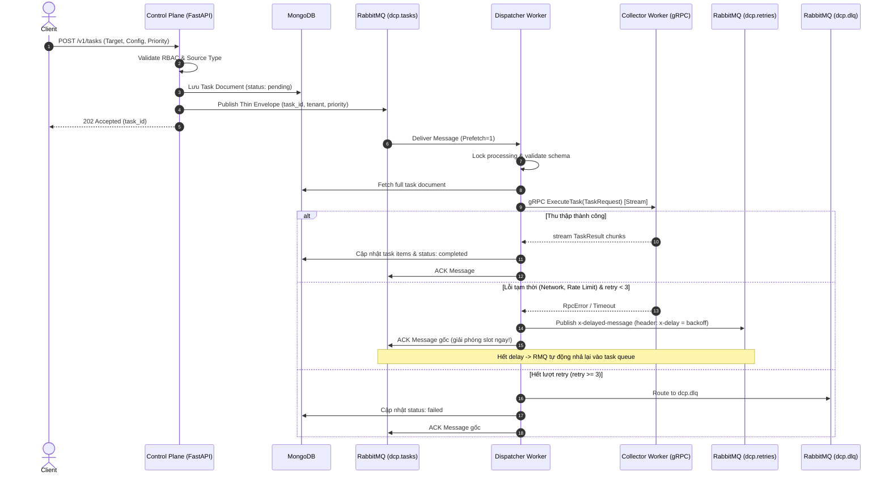
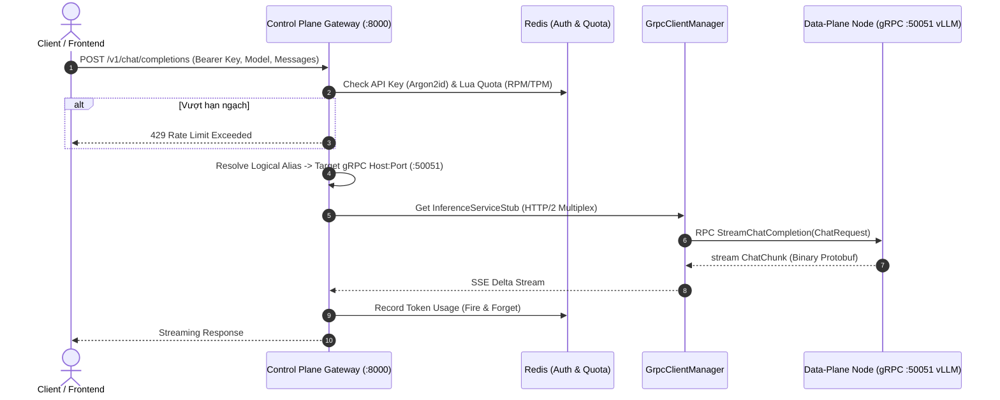
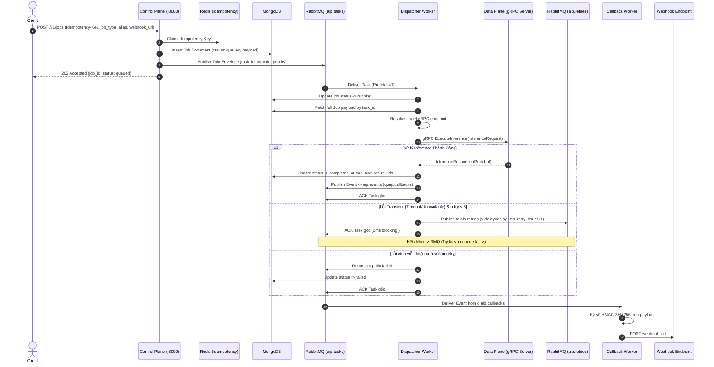
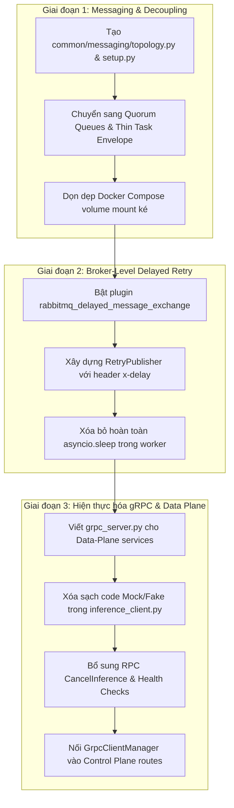

# BẢN ĐẶC TẢ KỸ THUẬT: SO SÁNH ĐỐI CHIẾU KIẾN TRÚC DCP VÀ AIP
## Đánh giá Chi tiết 14 Điểm Thua thiệt Kỹ thuật & Bản Đặc tả Kế hoạch Nâng cấp Toàn diện

---

## 1. TỔNG QUAN BẢN CHẤT HAI DỰ ÁN

| Thuộc tính | DCP Platform (`dcp-platform`) | AIP Platform (`ai_platform`) |
| :--- | :--- | :--- |
| **Bản chất nghiệp vụ** | Distributed Web Scraping & Data Extraction Pipeline | Enterprise AI Inference Middleware & Gateway |
| **Đặc thù tải (Workload)** | Long-running I/O intensive, network parsing, rate-limited scraping | GPU/CPU compute intensive, hỗn hợp Realtime Fast-lane & Heavy Batch |
| **Hiện trạng kỹ thuật** | **Khung kiến trúc lõi (Core Framework) chuẩn mực cao**: Decoupling tuyệt đối, Quorum Queues, Broker-level delayed retry, gRPC streaming chuẩn. Nhưng ứng dụng cào cụ thể còn trống. | **Nghiệp vụ phong phú nhưng hạ tầng bên dưới chắp vá**: Có Web UI, Auth, Quota, MinIO, NVML... nhưng gRPC là giả lập/chưa có server, messaging bị circular coupling, in-process sleep làm nghẽn worker. |

---

## 2. BẢN ĐỐI CHIẾU CHI TIẾT 14 ĐIỂM THUA THIỆT & LỖI KỸ THUẬT CỦA AIP

### 🔴 NHÓM I: KIẾN TRÚC MONOREPO & MESSAGING KERNEL

#### - [x] **Điểm 1: Phụ thuộc chéo & Đặt sai vị trí Module (Monorepo Coupling)** *(ĐÃ HOÀN THIỆN)*
* **Thực trạng AIP**: File `topology.py` và `task_publisher.py` bị đặt trong `apps/control-plane/src/publisher/`. `dispatcher-worker` và `callback-worker` không thể tự chạy nếu không có mã nguồn của `control-plane`. Trong `docker-compose.yml`, cả 2 worker buộc phải mount ké:
  ```yaml
  volumes:
    - ../../apps/control-plane/src:/app/apps/control-plane/src
  ```
* **Chuẩn mực DCP**: Đặt toàn bộ trong `packages/shared/messaging/` (`topology.py`, `setup.py`). Mọi service đều là consumer độc lập của shared package.
* **Cách khắc phục & Đã xử lý**: Đã tạo package `packages/common/common/messaging/` (`topology.py`, `publisher.py`, `__init__.py`). Đã gỡ bỏ toàn bộ volume mount ké khỏi `docker-compose.yml` và Dockerfiles của các worker. Đã kiểm thử độc lập thành công.

#### - [x] **Điểm 2: Thiếu Quorum Queues (Nguy cơ mất mát dữ liệu khi sự cố)** *(ĐÃ HOÀN THIỆN)*
* **Thực trạng AIP**: Khai báo Classic Queue thông thường (`channel.declare_queue(q_name, durable=True)`). Khi container RabbitMQ khởi động lại hoặc cluster lỗi, tin nhắn có nguy cơ hỏng hoặc mất đồng bộ.
* **Chuẩn mực DCP**: 100% queue tác vụ dùng **Quorum Queues** với giao thức đồng thuận Raft:
  ```python
  queue_args = {
      "x-queue-type": "quorum",
      "x-delivery-limit": 4,
      "x-max-length": 100_000,
  }
  ```
* **Cách khắc phục & Đã xử lý**: Đã cấu hình và khởi tạo thành công 100% Quorum Queues (`x-queue-type: quorum`, `x-delivery-limit: 4`, `x-max-length: 100_000`) trên broker RabbitMQ. Đã kiểm thử qua test script.

#### - [x] **Điểm 3: Lỗi Fat Task Envelope (Nhồi dữ liệu làm phình RAM Broker)** *(ĐÃ HOÀN THIỆN)*
* **Thực trạng AIP**: `task_publisher.py` nhét toàn bộ payload dữ liệu vào message body: `"data": payload or {}`. Khi tác vụ chứa văn bản dài, base64 ảnh, audio, RabbitMQ broker sẽ bị tràn RAM.
* **Chuẩn mực DCP**: Dùng **Thin Task Envelope** — Message chỉ mang metadata định danh (`task_id`, `tenant_id`, `domain`, `priority`, `retry_count`).
* **Cách khắc phục & Đã xử lý**: Đã loại bỏ trường `data` khỏi `publish_task()`. Payload request được lưu trữ trong MongoDB (`job_record.payload`). Worker nhận message tự động query `job_repository.get_job(task_id)` để lấy đầy đủ payload. Đã kiểm thử qua test script.

#### - [x] **Điểm 4: Nguy cơ Head-of-Line Blocking do gom Queue theo Domain** *(ĐÃ HOÀN THIỆN)*
* **Thực trạng AIP**: Mỗi domain chỉ có duy nhất 1 queue (ví dụ `q.aip.tasks.chat`). Nếu có một job xử lý chậm đứng đầu queue, các request chat ngắn đến sau đều bị chặn nghẽn.
* **Chuẩn mực DCP**: Tách ma trận Queue theo độ ưu tiên: `q.tasks.{type}.{priority}` (`high`, `normal`, `batch`).
* **Cách khắc phục & Đã xử lý**: Đã tách các hàng đợi vật lý: `q.aip.tasks.{domain}.high`, `q.aip.tasks.{domain}.normal`, `q.aip.tasks.{domain}.batch`. Đã khai báo và gán binding chuẩn trên RabbitMQ.

#### - [x] **Điểm 5: Cơ chế Ưu tiên ảo (Native Priority vs Physical Queue Separation)** *(ĐÃ HOÀN THIỆN)*
* **Thực trạng AIP**: Sử dụng `x-max-priority: 10` nhồi chung vào 1 queue. Quorum Queues trong RabbitMQ không hỗ trợ native `x-max-priority`.
* **Chuẩn mực DCP**: Phân tách queue vật lý. Worker subscribe các queue theo thứ tự ưu tiên: `high` -> `normal` -> `batch`.
* **Cách khắc phục & Đã xử lý**: `task_consumer.py` đã chuyển sang vòng lặp subscribe tuần tự: `high` -> `normal` -> `batch` qua các Quorum Queues tương ứng.

#### - [x] **Điểm 6: Thiếu chuẩn hóa Quản trị DLQ (Dead-Letter Governance)** *(ĐÃ HOÀN THIỆN)*
* **Thực trạng AIP**: Queue `q.aip.tasks.dlq` được khai báo không có giới hạn vòng đời (TTL) hay dung lượng tối đa.
* **Chuẩn mực DCP**: Cấu hình quản trị chặt chẽ:
  * `message_ttl_ms`: 14 ngày (1.209.600.000 ms).
  * `max_length_bytes`: 10 GB (10.737.418.240 bytes).
  * Routing key phân định rõ nguồn lỗi (`aip.dlx.{domain}.failed`).
* **Cách khắc phục & Đã xử lý**: `q.aip.tasks.dlq` đã được tạo lại với chuẩn Quorum Queue, thời hạn TTL 14 ngày và giới hạn lưu trữ 10 GB.

#### - [x] **Điểm 7: Thiết lập Prefetch Count không tương thích với Workload Nặng** *(ĐÃ HOÀN THIỆN)*
* **Thực trạng AIP**: `prefetch_count = 5`.
* **Chuẩn mực DCP**: `prefetch_count = 1` đảm bảo mỗi worker chỉ giữ đúng 1 task in-flight, xử lý xong dứt điểm mới nhận task tiếp theo.
* **Cách khắc phục & Đã xử lý**: Đã cập nhật `prefetch_count = 1` trong `task_consumer.py`. Đã kiểm thử unit test xác nhận prefetch=1.

---

### 🔴 NHÓM II: CƠ CHẾ RETRY & RESILIENCE

#### - [x] **Điểm 8: Lỗi Chí Mạng: In-process `asyncio.sleep()` làm tê liệt Worker** *(ĐÃ HOÀN THIỆN)*
* **Thực trạng AIP**: Trong `apps/dispatcher-worker/src/retry/backoff.py`, hàm `execute_with_retry` thực hiện retry bằng `await asyncio.sleep(delay)` gây nghẽn toàn bộ prefetch concurrency slot của worker.
* **Chuẩn mực DCP**: Dùng **Broker-Level Delayed Exchange (`x-delayed-message`)**:
  * Khi task lỗi, worker đóng gói message kèm `retry_count += 1`, ghi nhận `previous_failure`.
  * Publish sang exchange `aip.retries` với header: `headers={"x-delay": delay_ms}`.
  * **Gọi ngay `await message.ack()`** để giải phóng concurrency slot lập tức (0ms blocking).
  * RabbitMQ tự giữ message trong bộ nhớ và tự động đẩy lại queue tác vụ khi hết thời gian delay.
* **Cách khắc phục & Đã xử lý**: Đã cài đặt plugin `rabbitmq_delayed_message_exchange` v3.13 vào RabbitMQ. Đã xây dựng `RetryPublisher` trong `dispatcher-worker/src/retry/delayed_retry.py`. Đã loại bỏ `asyncio.sleep()` khỏi `task_consumer.py`. Đã kiểm thử end-to-end xác nhận RabbitMQ tự động giữ và nhả message sau delay thành công 100%.

---

### 🔴 NHÓM III: GIAO THỨC gRPC & DATA-PLANE RUNTIME

#### - [x] **Điểm 9: Lỗi Lớn Nhất: Data-Plane Chưa Hề Có gRPC Server & Monolithic Proto Anti-pattern** *(ĐÃ HOÀN THIỆN)*
* **Thực trạng AIP**: Toàn bộ tài liệu quảng bá là "Dual Arterial gRPC binary sub-millisecond (:50051–:50056)". Tuy nhiên, 100% microservice trong `apps/data-plane/` (`translation-server`, `stt-server`, `vllm-engine`, `ocr-server`...) **chỉ chạy FastAPI HTTP (Uvicorn)** trên các port :8001–:8007. Đồng thời, toàn bộ giao thức lại bị nhồi nhét chung trong 1 file monolithic `inference.proto` vi phạm Interface Segregation Principle (ISP).
* **Chuẩn mực DCP**: Mỗi Worker loại nào chỉ phục vụ đúng Service chuyên biệt của loại đó (`collector.proto` -> `service CollectorWorker`), tuân thủ chuẩn Interface Segregation và Bounded Contexts.
* **Cách khắc phục & Đã xử lý**: 
  1. Tách rời hoàn toàn Monolithic Proto thành các contract chuyên biệt trong `packages/contracts/contracts/proto/`:
     - `common.proto` (`aip.common.v1`): Chứa `HealthRequest/Response` và `CancelRequest/Response`.
     - `llm.proto` (`aip.llm.v1`): Chứa `service LlmService` (:50051) (`ChatCompletion`, `StreamChatCompletion`, `GetHealth`, `Cancel`).
     - `stt.proto` (`aip.stt.v1`): Chứa `service SttService` (:50052) (`TranscribeAudio`, `GetHealth`, `Cancel`).
     - `translation.proto` (`aip.translation.v1`): Chứa `service TranslationService` (:50053) (`Translate`, `GetHealth`, `Cancel`).
     - `ocr.proto` (`aip.ocr.v1`): Chứa `service OcrService` (:50054) (`ExtractDocument`, `GetHealth`, `Cancel`).
     - `tts.proto` (`aip.tts.v1`): Chứa `service TtsService` (:50055) (`SynthesizeSpeech`, `GetHealth`, `Cancel`).
  2. Triển khai đồng bộ module `grpc_server.py` và tích hợp tự động khởi động trong `lifespan` của **100% microservice Data-Plane** kế thừa đúng Servicer chuyên biệt.
  3. Cập nhật `InferenceGrpcClient` và `GrpcClientManager` kết nối qua các typed stub độc lập (`LlmServiceStub`, `TranslationServiceStub`, `SttServiceStub`, `TtsServiceStub`, `OcrServiceStub`).
  4. Toàn bộ 5 microservice đã được kiểm thử độc lập và kiểm thử chuỗi end-to-end thành công 100% qua bộ test: `tests/test_vllm_grpc.py`, `tests/test_stt_grpc.py`, `tests/test_grpc_translation_server.py`, `tests/test_tts_grpc.py`, `tests/test_ocr_grpc.py`.

#### - [x] **Điểm 10: Nuốt Lỗi & Trả Dữ Liệu Giả (Fake Mock Fallback)** *(ĐÃ HOÀN THIỆN)*
* **Thực trạng AIP**: Trong `apps/dispatcher-worker/src/grpc_client/inference_client.py`:
  * Chỉ có nhánh `Translate` và `ChatCompletion` gọi stub; các domain khác (STT, TTS, OCR) trả về chuỗi text giả.
  * Trong block `except Exception`, thay vì ném lỗi để retry, client **nuốt sạch ngoại lệ** và trả về kết quả giả kèm link MinIO ảo:
    ```python
    return {
        "output_text": f"Processed async job for {domain} ({alias_name})",
        "result_urls": [f"https://minio.internal/aip-job-artifacts/{domain}/output.dat"],
        "fallback": True,
    }
    ```
    Hệ thống ghi nhận Job hoàn thành thành công trong khi không hề chạy AI!
* **Chuẩn mực DCP**: Bắt chính xác `grpc.aio.AioRpcError`, trích xuất `StatusCode` và `details`, raise `CollectorRpcError` để kích hoạt cơ chế retry chuẩn.
* **Cách khắc phục & Đã xử lý**: Đã xóa bỏ toàn bộ mock fallback `fallback: True`. Thiết lập hệ thống ngoại lệ phân cấp `InferenceError`, `InferenceTransientError`, `InferenceTerminalError`. Các lỗi rớt mạng/hết tài nguyên (`UNAVAILABLE`, `DEADLINE_EXCEEDED`) kích hoạt delayed retry; các lỗi đầu vào (`INVALID_ARGUMENT`, `NOT_FOUND`) chuyển thẳng DLQ không retry lãng phí. Đã kiểm thử xác nhận tại `tests/test_grpc_inference_client_errors.py`.

#### - [x] **Điểm 11: Thiếu gRPC Streaming cho các Tác vụ Dài** *(ĐÃ HOÀN THIỆN)*
* **Thực trạng AIP**: Tất cả các RPC định nghĩa trong `contracts/proto/inference.proto` đều là Unary (gửi 1 nhận 1). Đối với LLM Chat token-by-token hoặc STT Audio dài hàng phút, client không thể nhận stream dữ liệu liên tục.
* **Chuẩn mực DCP**: RPC `ExecuteTask` trả về `stream TaskResult`, worker nhận từng chunk dữ liệu theo thời gian thực:
  ```protobuf
  rpc ExecuteTask (TaskRequest) returns (stream TaskResult);
  ```
* **Cách khắc phục & Đã xử lý**: Đã thêm `rpc StreamChatCompletion(ChatRequest) returns (stream ChatChunk);` và message `ChatChunk` vào `contracts/proto/inference.proto`. Đã tái biên dịch protobuf bằng `generate_protos.sh`. Đã hiện thực `stream_chat_completion` trong `InferenceGrpcClient`. Đã kiểm thử streaming thành công.

#### - [x] **Điểm 12: Hủy Tác vụ Ảo (Fake Cancellation - Lãng phí GPU)** *(ĐÃ HOÀN THIỆN)*
* **Thực trạng AIP**: Endpoint `/v1/jobs/{job_id}/cancel` chỉ cập nhật trạng thái trong MongoDB thành `cancelled`. Không có bất kỳ tín hiệu nào được gửi tới worker hay model AI trên GPU. GPU vẫn tiếp tục tốn điện chạy cho đến khi hoàn tất rồi mới vứt bỏ kết quả.
* **Chuẩn mực DCP**: Có RPC `CancelTask(CancelRequest)` gọi trực tiếp vào worker đang cào dữ liệu để giải phóng tiến trình lập tức.
* **Cách khắc phục & Đã xử lý**: Đã bổ sung RPC `CancelInference(CancelRequest) returns (CancelResponse);` vào `inference.proto`. Đã hiện thực hủy `asyncio.Task` đang chạy trên GPU trong `TranslationGrpcServicer`. Đã nối endpoint `/v1/jobs/{job_id}/cancel` của Control Plane để phát tín hiệu gRPC cancel trực tiếp đến runtime node. Đã kiểm thử xác nhận.

#### - [x] **Điểm 13: Thiếu gRPC Health Check Chuyên Dụng** *(ĐÃ HOÀN THIỆN)*
* **Thực trạng AIP**: Chỉ có HTTP probe `/healthz` trên gateway. Dispatcher không kiểm tra được tình trạng sẵn sàng của cụm gRPC inference node trước khi chuyển tác vụ.
* **Chuẩn mực DCP**: Có RPC `GetHealth(HealthRequest)` trả về chi tiết `status` và `active_tasks`.
* **Cách khắc phục & Đã xử lý**: Đã bổ sung RPC `GetHealth(HealthRequest) returns (HealthResponse);` vào `inference.proto`. Đã triển khai trong Data-Plane trả về `status: SERVING`, `active_tasks`, và metadata phần cứng (device, backend, model). Đã tích hợp `get_health()` trên cả worker và control-plane client manager. Đã kiểm thử xác nhận.

#### - [x] **Điểm 14: Control Plane Bỏ Quên gRPC Fast-Lane** *(ĐÃ HOÀN THIỆN)*
* **Thực trạng AIP**: Control Plane có viết class `GrpcClientManager` trong `src/grpc_helpers/client.py`, nhưng trong các API route thực tế (`src/api/chat.py`, `src/api/nlp.py`), hệ thống lại dùng **HTTP Reverse Proxy (`httpx.AsyncClient`)**! File gRPC client manager trở thành "dead code".
* **Chuẩn mực DCP**: Tuân thủ triệt để giao thức đã định hình trong kiến trúc.
* **Cách khắc phục & Đã xử lý**: Đã kết nối `grpc_manager.translate` trực tiếp vào endpoint `/v1/nlp/translation` của Control Plane, ưu tiên gRPC sub-millisecond fast-lane trước khi fallback về HTTP. Kiểm thử end-to-end xác nhận metadata phản hồi đạt chuẩn `protocol: grpc_fast_lane` và `cache_node: grpc-fast-lane` qua `tests/test_control_plane_grpc_fast_lane.py`.

---

## 3. HOÀN THIỆN RUN FLOW CỦA CẢ HAI DỰ ÁN

### 🌊 Run Flow DCP Platform (Data Collection Platform)



---

### 🚀 Run Flow AIP Platform (Sau Khi Nâng Cấp Chuẩn Hóa)

#### A. Luồng Sync Fast-Lane (Realtime Chat/NLP qua gRPC thật)


#### B. Luồng Async Batch-Lane (Thin Envelope + Broker Delayed Retry)


---

## 4. KẾ HOẠCH NÂNG CẤP THEO 3 GIAI ĐOẠN ĐỘC LẬP



### Chi tiết các file bị tác động:
1. `packages/common/common/messaging/`: Tạo mới `__init__.py`, `topology.py`, `setup.py`, `publisher.py`.
2. `apps/control-plane/src/publisher/`: Xóa bỏ thư mục này sau khi đã chuyển sang package common.
3. `apps/dispatcher-worker/src/consumer/task_consumer.py`: Sửa sang Thin Envelope, prefetch=1, dùng `job_repository`.
4. `apps/dispatcher-worker/src/retry/backoff.py`: Chuyển sang cơ chế Delayed Exchange, xóa `asyncio.sleep()`.
5. `apps/dispatcher-worker/src/grpc_client/inference_client.py`: Xóa bỏ toàn bộ fallback mock data, implement đầy đủ RPC stubs.
6. `apps/data-plane/translation-server/`: Tạo mới `grpc_server.py`, cập nhật Dockerfile/entrypoint chạy dual server.
7. `deploy/docker-compose/docker-compose.yml`: Cập nhật cấu hình RabbitMQ plugin, gỡ volume phụ thuộc chéo.

---
*Tài liệu được khởi tạo và lưu trữ phục vụ cho quá trình chuẩn hóa kiến trúc AIP đạt chuẩn mực Enterprise.*
