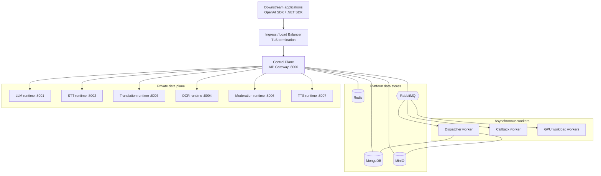
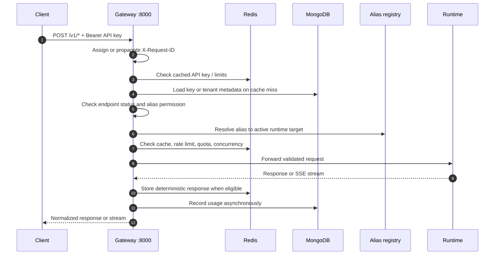
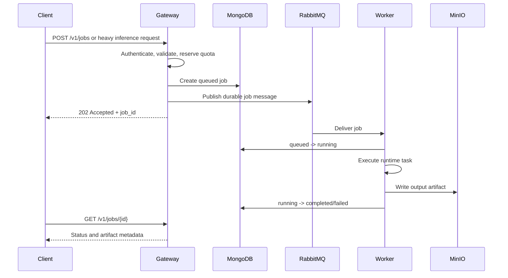

# Everwin AI Platform (AIP) Architecture

**Status:** Phase 1 implementation review  
**Last updated:** September 24, 2026  
**Scope:** Self-hosted AI inference middleware and runtime platform

This document describes the architecture that exists in this repository and identifies the gaps that must be closed before claiming full SRS compliance. It is intentionally split into **current state**, **request flows**, and **implementation backlog**.

## 1. Purpose and Boundaries

AIP is a control plane in front of heterogeneous AI runtimes. It provides a common `/v1` API surface, API-key authentication, alias-based routing, quota and rate-limit controls, caching, asynchronous offload, usage recording, and operational visibility.

AIP is not the downstream business application. Downstream applications own prompts, RAG workflows, business decisions, UI, and domain-specific orchestration.

### 1.1 AIP responsibilities

- Authenticate API clients and enforce alias permissions.
- Validate public request schemas.
- Resolve logical model aliases to runtime targets.
- Apply rate limits, quotas, cache policy, and admission controls.
- Forward requests to specialized data-plane runtimes.
- Normalize public responses and stream compatible SSE responses.
- Record usage, audit events, and runtime health.
- Offload heavy work to RabbitMQ-backed workers.

### 1.2 Out of scope

- Prompt ownership and prompt templates.
- RAG, vector database workflows, and business workflows.
- Model training, fine-tuning, or evaluation pipelines.
- Direct public access to data-plane runtimes.
- Automatic model fallback without an explicit routing policy.

## 2. System Context



Only the gateway should be reachable by external clients. Runtime services are internal network dependencies. In local Docker Compose, runtime services use `expose` rather than host-published ports; in Kubernetes, access is controlled by Services and NetworkPolicies.

## 3. Deployable Components

### 3.1 Control plane

| Component                | Current location                                     | Responsibility                                    |
| ------------------------ | ---------------------------------------------------- | ------------------------------------------------- |
| Gateway                  | `control-plane/src`                                  | FastAPI public API, middleware, routing, proxying |
| Auth middleware          | `control-plane/src/auth`                             | API key lookup, alias permission, tenant context  |
| Alias router             | `control-plane/src/items/alias_router.py`            | Mongo-backed alias registry with catalog fallback |
| Endpoint registry        | `packages/common/.../endpoint_repository.py`         | API catalog and export status                     |
| Usage and cache services | `control-plane/src/usage`, `control-plane/src/cache` | Usage recording and Redis inference cache         |
| Job publisher            | `control-plane/src/publisher`                        | RabbitMQ topology and task publication            |
| Health service           | `control-plane/src/status`                           | Runtime and platform health reporting             |

### 3.2 Data plane

| Service            | Compose/Kubernetes port | Runtime endpoint                                            | Current implementation                                       |
| ------------------ | ----------------------: | ----------------------------------------------------------- | ------------------------------------------------------------ |
| vLLM engine        |                    8001 | `/v1/chat/completions`, `/v1/completions`, `/v1/embeddings` | FastAPI + Transformers model loader; not native `vllm serve` |
| STT server         |                    8002 | `/v1/audio/transcriptions`                                  | Faster-Whisper pipeline                                      |
| Translation server |                    8003 | `/v1/predictions`                                           | CTranslate2 translation service                              |
| OCR server         |                    8004 | `/v1/ocr/process`                                           | PaddleOCR/EasyOCR fallback pipeline                          |
| Moderation server  |                    8006 | `/v1/moderations`                                           | Hybrid model/rule moderation engine                          |
| TTS adapter        |                    8007 | `/v1/audio/speech`                                          | TTS adapter and audio generation                             |

The gateway exposes public routes separately from runtime routes. For example, public `/v1/ocr/id-card` is adapted to runtime `/v1/ocr/process`.

### 3.3 Infrastructure

- MongoDB: aliases, endpoints, API keys, jobs, usage, audit, and metadata.
- Redis: authentication cache, rate-limit state, inference cache, idempotency state.
- RabbitMQ: heavy inference jobs, callbacks, retries, and dead-letter handling.
- MinIO: uploaded inputs and generated artifacts.
- Prometheus, Grafana, and Alertmanager: metrics and operational monitoring.

## 4. Public API Surface

The gateway owns the public contract. Runtime paths are not public API contracts.

| Public endpoint            | Method  | Route behavior                                                 |
| -------------------------- | ------- | -------------------------------------------------------------- |
| `/v1/chat/completions`     | POST    | Resolve requested alias, then proxy to LLM runtime             |
| `/v1/completions`          | POST    | Legacy completion route                                        |
| `/v1/embeddings`           | POST    | Resolve embedding alias, then proxy to LLM runtime             |
| `/v1/audio/transcriptions` | POST    | Resolve STT alias, then call STT runtime                       |
| `/v1/audio/speech`         | POST    | Resolve TTS alias, then call TTS runtime                       |
| `/v1/moderations`          | POST    | Resolve moderation alias, then call moderation runtime         |
| `/v1/ocr/*`                | POST    | Resolve OCR alias, then call OCR runtime                       |
| `/v1/nlp/translation`      | POST    | Resolve translation alias, then call translation runtime       |
| `/v1/predictions`          | POST    | Resolve caller-selected alias and dispatch by runtime metadata |
| `/v1/models`               | GET     | List enabled aliases allowed for the API key                   |
| `/v1/jobs`                 | POST    | Create an asynchronous job                                     |
| `/v1/jobs/{id}`            | GET     | Read job state                                                 |
| `/admin/v1/*`              | Various | Admin-only management APIs                                     |

All authenticated public requests should use `Authorization: Bearer <api-key>`. Health and operational endpoints are explicitly exempted where appropriate.

## 5. Alias and Endpoint Model

### 5.1 Alias resolution

An alias is a logical client-facing model identifier such as `chat-general-standard` or `stt-vn-standard`. The alias document contains runtime metadata and a target URL.

```json
{
  "alias_name": "chat-general-standard",
  "physical_model": "Qwen2.5-1.5B-Instruct",
  "runtime": "vllm",
  "target_url": "http://vllm-engine:8001/v1",
  "status": "enabled",
  "timeout_seconds": 120
}
```

The current implementation loads the MongoDB alias registry during gateway startup and refreshes it after admin status changes. The static catalog is retained as an offline fallback when MongoDB is unavailable. An alias must be `enabled` or `active` to resolve.

### 5.2 Endpoint registry

The `endpoints` collection is a public API catalog and feature gate. It stores path, method, description, documentation, pricing, and status. It does not perform runtime dispatch.

The authentication middleware checks endpoint status before passing a request to a route. The registry is preloaded during gateway startup. Hidden compatibility paths are normalized to their canonical endpoint when their status is checked.

### 5.3 Seed policy

Seed scripts must be idempotent and non-destructive:

- Upsert by `alias_name` or `endpoint_id`.
- Never delete the whole collection as part of a normal seed.
- Use gateway URLs in public documentation.
- Use internal Docker/Kubernetes service DNS names for runtime targets.
- Never commit production credentials or hardcoded MongoDB connection strings.

## 6. Synchronous Request Flow



Failure mapping should remain stable:

| Condition              | HTTP | Code                                     |
| ---------------------- | ---: | ---------------------------------------- |
| Invalid API key        |  401 | `unauthorized`                           |
| Alias not permitted    |  403 | `forbidden_alias`                        |
| Alias missing/disabled |  404 | `alias_not_found`                        |
| Rate or quota limit    |  429 | `rate_limit_exceeded` / `quota_exceeded` |
| Runtime capacity       |  503 | `capacity_exhausted`                     |
| Runtime unavailable    |  503 | `runtime_unavailable`                    |
| Runtime timeout        |  504 | `runtime_timeout`                        |

## 7. Streaming and Asynchronous Flows

### 7.1 Streaming

For `stream=true`, the gateway opens an upstream stream and returns `text/event-stream`. Chunks should be forwarded without buffering. The gateway must emit `data: [DONE]` after the upstream closes and record usage after the stream completes.

### 7.2 Heavy inference jobs

Heavy requests may be offloaded:



Job creation must be idempotent when `Idempotency-Key` is required by the public contract. Retry, dead-letter, cancellation, quota release, and webhook signing must be explicit state transitions rather than implicit best effort.

## 8. Local and Kubernetes Deployment

### 8.1 Docker Compose contract

| Service     | Internal DNS         | Port |
| ----------- | -------------------- | ---: |
| Gateway     | `control-plane`      | 8000 |
| LLM runtime | `vllm-engine`        | 8001 |
| STT         | `stt-server`         | 8002 |
| Translation | `translation-server` | 8003 |
| OCR         | `ocr-server`         | 8004 |
| Moderation  | `moderation-server`  | 8006 |
| TTS         | `tts-adapter`        | 8007 |

The gateway uses these service names for internal routing. Data-plane ports are not published to the host in the Compose configuration.

### 8.2 Kubernetes contract

Helm values define the runtime ports and Services. Runtime pods must receive labels that match the NetworkPolicy selectors. Only the gateway namespace should be ingress-facing. Runtime namespaces should allow ingress from the gateway and egress only to approved infrastructure and DNS.

## 9. Security Boundaries

- API keys are accepted only through the gateway public surface.
- Runtime services perform a minimum internal Bearer-header check, but they are not a replacement for gateway authentication.
- Data-plane services must not be reachable from external clients.
- Admin APIs require admin authorization and CIDR protection.
- Secrets must come from environment or secret management, not source files.
- Uploaded files require size, MIME, extension, checksum, and malware-scan policy.
- MinIO buckets should remain private; clients receive time-limited presigned URLs.
- Webhooks must use HMAC-SHA256 signatures and replay protection.

## 10. Current Implementation Gaps and Backlog

The following list is intentionally explicit. The presence of a route or configuration entry does not mean the corresponding SRS capability is complete.

### P0: correctness and security blockers

| ID    | Issue                                                                                                    | Impact                                                                                        | Required fix                                                                                                 |
| ----- | -------------------------------------------------------------------------------------------------------- | --------------------------------------------------------------------------------------------- | ------------------------------------------------------------------------------------------------------------ |
| P0-01 | **Resolved:** production MongoDB URI and credentials are no longer hardcoded in Python/config defaults.  | Existing exposed credentials still require rotation outside this repository.                  | Rotate previously exposed credentials and keep all deployment secrets in secret storage.                     |
| P0-02 | **Resolved for admin updates:** alias changes publish Redis invalidation events to gateway replicas.     | External DB edits still require an explicit mutation event or a future MongoDB change stream. | Route all alias mutations through the repository/admin API; add change-stream support for out-of-band edits. |
| P0-03 | **Resolved in manifests:** runtime pod labels, namespaces, and NetworkPolicy selectors now align.        | Rendered manifests still need cluster-level connectivity verification.                        | Add `kubectl`/integration policy tests in CI.                                                                |
| P0-04 | **Resolved with shared runtime token:** data-plane services enforce `AIP_RUNTIME_TOKEN` when configured. | Token distribution and rotation still require deployment-secret verification.                 | Store the token in Kubernetes/Docker secret management, rotate it, and add direct-runtime rejection tests.   |

### P1: SRS behavior gaps

| ID    | Issue                                                                                                                                          | Impact                                                                                                      | Required fix                                                                                |
| ----- | ---------------------------------------------------------------------------------------------------------------------------------------------- | ----------------------------------------------------------------------------------------------------------- | ------------------------------------------------------------------------------------------- |
| P1-01 | Native vLLM is not running; the service uses Transformers inside FastAPI.                                                                      | The deployment does not provide vLLM scheduling, batching, or PagedAttention semantics promised by the SRS. | Either migrate to native `vllm serve` or change the SRS/runtime name permanently.           |
| P1-02 | **Partially resolved:** `embed-standard` metadata now matches the Transformers mean-pooling implementation and test dimension.                 | Mean-pooled causal-LM vectors still need semantic-quality validation.                                       | Deploy/benchmark a dedicated embedding model and lock the dimension/similarity contract.    |
| P1-03 | **Resolved for production:** in-process runtime fallback is disabled unless explicitly enabled outside production.                             | Development may still opt into fallback for local testing.                                                  | Keep `ALLOW_IN_PROCESS_FALLBACK=false` in production and add a deployment policy check.     |
| P1-04 | **Resolved in gateway middleware:** API keys now support `allowed_endpoints` scopes with wildcard compatibility.                               | Existing keys without scopes remain unrestricted until migrated.                                            | Seed explicit endpoint scopes for production keys and add admin UI/API management.          |
| P1-05 | Alias versioning, canary, blue/green, and deprecated headers are not implemented end-to-end.                                                   | SRS rollout and lifecycle guarantees are not available.                                                     | Add version documents, active-version selection, weighted routing, and deprecation headers. |
| P1-06 | **Partially resolved:** per-key rate/concurrency checks use atomic Redis Lua and now fail closed when Redis is unavailable.                    | Per-alias limits and concurrent-load integration tests are still missing.                                   | Add alias-aware buckets and load tests.                                                     |
| P1-07 | **Partially resolved:** Redis NX claims prevent concurrent duplicate job creation and Redis failure no longer creates an unprotected job.      | Retry/DLQ, cancellation races, durable idempotency records, and artifact contract still need coverage.      | Add durable idempotency records and worker state-transition tests.                          |
| P1-08 | **Partially resolved:** translation prediction dispatch now matches runtime metadata case-insensitively and sends `source_lang`/`target_lang`. | Other specialized adapters still need complete contract tests.                                              | Add public-to-runtime contract tests for every adapter and document each mapping.           |

### P2: operational and quality gaps

| ID    | Issue                                                                                  | Impact                                                                 | Required fix                                                                               |
| ----- | -------------------------------------------------------------------------------------- | ---------------------------------------------------------------------- | ------------------------------------------------------------------------------------------ |
| P2-01 | Runtime model volume/cache strategy is inconsistent across services.                   | Containers may redownload models or fail offline.                      | Define model registry, cache path, persistence, warm-up, and offline behavior per runtime. |
| P2-02 | README and seed metadata contain historical model names and claims.                    | Operators may deploy or document models that are not actually present. | Generate catalog/documentation from a validated model manifest.                            |
| P2-03 | Error response and timeout behavior vary between adapters.                             | SDKs cannot rely on one stable error contract.                         | Centralize error mapping and add contract tests for every public endpoint.                 |
| P2-04 | Observability does not yet prove all SRS metrics and alerts are emitted.               | Runtime failures and quota regressions may be invisible.               | Add metric acceptance tests and dashboards for gateway, runtime, queue, and GPU groups.    |
| P2-05 | Full integration tests require Redis, MongoDB, RabbitMQ, MinIO, and ML dependencies.   | Unit tests can pass while deployment wiring fails.                     | Add a reproducible test profile using Docker Compose and lightweight test runtimes.        |
| P2-06 | Public endpoint seed data includes domains that are not implemented by local runtimes. | API catalog can advertise unavailable image/video/vision capabilities. | Mark unavailable APIs disabled or seed only validated routes.                              |
| P2-07 | Admin updates do not consistently create audit events.                                 | Configuration changes are difficult to investigate.                    | Record actor, source IP, before/after state, and request ID for every admin mutation.      |

## 11. Acceptance Checklist

Before calling the implementation SRS-compliant, verify all of the following:

- [x] No production credential exists in Python source or configuration defaults. Previously exposed credentials still require rotation.
- [x] Admin alias changes propagate to every gateway replica without restart through Redis pub/sub.
- [ ] Alias disabled status blocks every public route using that alias.
- [ ] Endpoint disabled status blocks canonical and compatibility paths.
- [ ] Every public route has an integration test for auth, routing, timeout, and error mapping.
- [x] Data-plane ports are inaccessible from outside the gateway network in Compose; Kubernetes requires cluster policy testing.
- [ ] Kubernetes rendered labels and NetworkPolicies permit only intended traffic (manifest alignment fixed; cluster test pending).
- [ ] Embeddings use a real, documented model with tested dimensions.
- [ ] Native vLLM claims are either implemented or removed from the SRS.
- [ ] Heavy jobs are idempotent, durable, retryable, cancellable, and observable.
- [ ] Runtime model caches and artifact retention are documented and tested.
- [ ] Prometheus metrics and critical alerts are verified in a running environment.

## 12. Source of Truth

- Runtime ports and Compose service names: `deploy/docker-compose/docker-compose.yml`.
- Kubernetes runtime values: `deploy/helm/aip-runtimes/values.yaml`.
- Public gateway routes: `control-plane/src/api`.
- Alias fallback catalog: `packages/common/common/models/catalog.py`.
- MongoDB alias and endpoint repositories: `packages/common/common/repositories`.
- Database seed definitions: `migrations/seed_database.py`.
- API catalog seed definitions: `scripts/seed_13_apis.py`.
- Automated verification: `tests/`.
