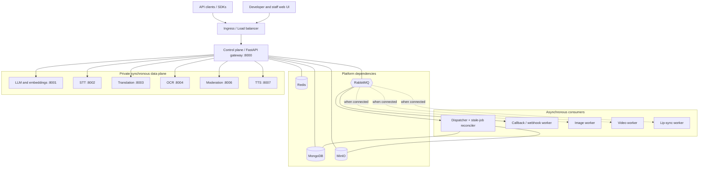
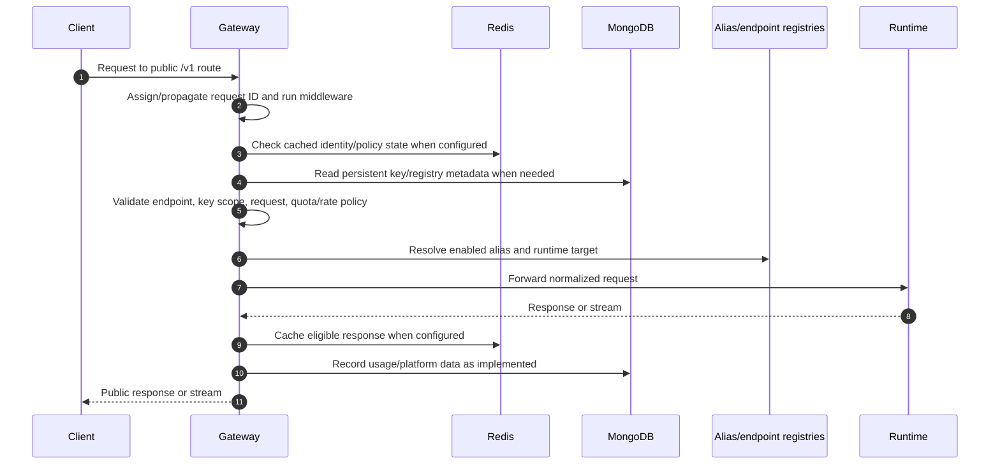
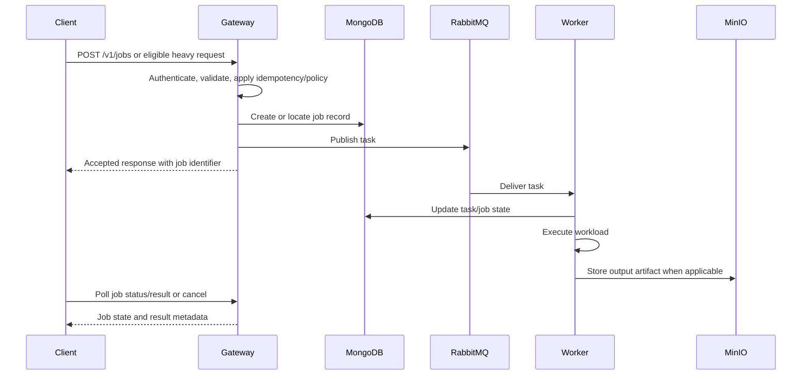

# Everwin AI Platform (AIP) Architecture

**Status:** Current implementation map
**Last updated:** September 28, 2026
**Scope:** Self-hosted AI API gateway, inference runtimes, asynchronous workers, and supporting infrastructure

This document is the starting point for understanding how AIP components collaborate, how requests move through the platform, and which capabilities are implemented versus still require validation. It follows the component, flow, deployment, and operational-gap structure used by the DCP architecture reference, while describing AIP as it exists in this repository.

**Related source-of-truth documents and code**

- [README](README.md) — repository setup and developer quick start.
- [Docker Compose stack](deploy/docker-compose/docker-compose.yml) — local services, profiles, ports, and dependencies.
- [Runtime Helm values](deploy/helm/aip-runtimes/values.yaml) — Kubernetes runtime deployment settings.
- [Gateway route registration](control-plane/src/main.py) — routers mounted by the public API.
- [Static model alias catalog](packages/common/common/models/catalog.py) — local fallback aliases.
- [API source](control-plane/src/api/) — public route implementations.
- [Worker source](workers/) — asynchronous consumers and GPU workload workers.

## 1. Overview

AIP is a self-hosted inference platform with a FastAPI control plane in front of specialized AI runtimes. The gateway owns the client-facing API surface, authenticates requests, resolves logical aliases, applies platform policy, and dispatches work to data-plane services or asynchronous workers.

The platform is distributed across independently deployable components. A *route* is a public operation, a *model alias* is a logical runtime selection, and a *service* is a deployable process. Their counts are not expected to match: one runtime can serve multiple aliases and routes, while workers and infrastructure services are not models.

The static fallback catalog currently defines seven logical aliases across chat, embeddings, translation, speech-to-text, text-to-speech, OCR/document processing, and moderation. MongoDB-backed registry data may differ from that fallback. A route, seed entry, or deployment setting alone does not establish that a model is loaded or production-ready.

### 1.1 Responsibilities

- Authenticate API clients and enforce configured key, endpoint, and alias policies.
- Resolve logical aliases to configured internal runtime targets.
- Expose standardized AI APIs and platform management routes.
- Apply quota, rate-limit, cache, and admission controls where configured.
- Forward synchronous requests and streaming responses to runtimes.
- Publish eligible heavy work to RabbitMQ and expose job status/result operations.
- Record usage and expose health, metrics, and administration surfaces.

### 1.2 Boundaries

- Downstream applications own business workflows, prompts, and RAG orchestration.
- Production data-plane runtimes and workers should not be directly exposed to API clients.
- MongoDB, Redis, RabbitMQ, and MinIO can be run in the local Compose stack or supplied as deployment infrastructure; they are not inherently external-only.
- AIP does not provide a guarantee of model fallback, rollout, or high availability unless the relevant routing and deployment policy is explicitly configured and tested.

## 2. System Context



The intended production boundary is the gateway: client traffic enters through an ingress or load balancer and data-plane services remain private. Local development intentionally publishes additional infrastructure and frontend ports; see the Compose contract below.

## 3. Deployable Components

### 3.1 Gateway and portal

| Component | Location | Responsibility |
| --- | --- | --- |
| Control plane | `control-plane/src` | FastAPI routes, middleware, authentication, alias resolution, request dispatch, jobs, health, and administration. |
| Web portal | `frontend/` | Developer/staff interface served separately from the API gateway. |

The gateway registers standard inference routes, specialized OCR/vision/NLP routes, job and prediction APIs, identity and portal APIs, usage/simulation APIs, admin routes, status probes, and schema/resource routes. The mounted router list in `control-plane/src/main.py` is the source for the route groups.

### 3.2 Synchronous data plane

| Runtime | Internal port | Main API role | Current-state note |
| --- | ---: | --- | --- |
| `vllm-engine` | 8001 | Chat completions, completions, embeddings | The service name and alias metadata say vLLM; verify the serving implementation and model before claiming native vLLM behavior. |
| `stt-server` | 8002 | Audio transcription | Faster-Whisper based service. |
| `translation-server` | 8003 | Translation/prediction | CTranslate2-based service. |
| `ocr-server` | 8004 | Document and identity OCR | OCR pipeline with configured engine/fallback behavior. |
| `moderation-server` | 8006 | Text/content moderation | Hybrid model/rule service. |
| `tts-adapter` | 8007 | Audio speech synthesis | TTS adapter service. |

Public paths are gateway contracts and need not match runtime paths. For example, an OCR route can adapt a public document-specific operation to a runtime processing endpoint.

### 3.3 Asynchronous workers

| Worker | Location | Role |
| --- | --- | --- |
| Dispatcher | `workers/orchestration/dispatcher-worker` | Consumes queued tasks and runs stale-job reconciliation against MongoDB. |
| Callback | `workers/orchestration/callback-worker` | Consumes callback events and delivers webhook notifications. |
| Image | `workers/gpu-workloads/image-worker` | Consumes the configured image task queue and writes job artifacts to MinIO. |
| Video | `workers/gpu-workloads/video-worker` | Separate video workload worker package. |
| Lip-sync | `workers/gpu-workloads/lipsync-worker` | Separate lip-sync workload worker package. |

The presence of a worker package does not mean that a public API route, queue binding, local Compose service, trained model, or production deployment is wired for it. In the current Compose file, the image worker is present under optional profiles; video and lip-sync workers are not listed there.

### 3.4 Platform infrastructure

- **MongoDB:** alias/endpoint registry and platform records such as jobs and usage.
- **Redis:** authentication/rate-limit/cache/idempotency state as enabled by the gateway configuration.
- **RabbitMQ:** task and callback messaging.
- **MinIO:** input and generated artifact storage.
- **Prometheus, Grafana, Alertmanager:** optional local monitoring stack.
- **Runtime probe:** a separate repository component for runtime/hardware probing; it is not listed as a service in the current Docker Compose file.

## 4. Public API Surface

The gateway owns the public API. These are route groups, not a claim that every operation is enabled for every key or ready for production:

| API group | Representative public paths | Purpose |
| --- | --- | --- |
| Chat and completions | `POST /v1/chat/completions`, `POST /v1/completions` | Text generation and chat. |
| Embeddings and models | `POST /v1/embeddings`, `GET /v1/models`, `GET /v1/models/{alias}` | Vectorization and alias discovery. |
| Audio | `POST /v1/audio/transcriptions`, `POST /v1/audio/speech` | Speech-to-text and text-to-speech. |
| Images | `POST /v1/images/generations`, `POST /v1/images/edits` | Image request handling; see implementation gaps below. |
| Moderation | `POST /v1/moderations` | Content moderation. |
| OCR | `POST /v1/ocr`, `/v1/ocr/process`, `/v1/ocr/id-card`, `/v1/ocr/driver-license`, `/v1/ocr/passport` | Document extraction. |
| Vision | `POST /v1/vision/facematch`, `POST /v1/vision/liveness` | Face matching and liveness operations. |
| NLP | `POST /v1/nlp/translation`, `POST /v1/nlp/summarization` | Translation and summarization. |
| Predictions and jobs | `POST /v1/predictions`, `POST /v1/jobs`, `GET /v1/jobs/{job_id}`, `GET /v1/jobs/{job_id}/result`, `POST /v1/jobs/{job_id}/cancel` | Custom dispatch and asynchronous work. |
| Platform APIs | `/v1/auth/*`, `/v1/user/*`, `/v1/usage/*`, `/v1/simulations/*`, `/v1/mcp/*`, `/admin/v1/*` | Identity, portal, usage, test/simulation, MCP, and administrative operations. |

Exact methods, hidden compatibility paths, schemas, and authorization rules are defined in the router source and generated OpenAPI document. Do not treat a seeded API catalog entry as proof of route implementation.

## 5. Alias and Endpoint Model

### 5.1 Model aliases

An alias is a logical client-facing identifier that selects runtime metadata. The static fallback catalog in `packages/common/common/models/catalog.py` currently defines seven aliases, for example:

```json
{
  "id": "chat-general-standard",
  "physical_model": "Qwen2.5-1.5B-Instruct",
  "runtime": "vLLM",
  "target_url": "http://vllm-engine:8001/v1",
  "status": "active"
}
```

Gateway startup attempts to load MongoDB-backed alias and endpoint registries and starts an alias update listener. The code logs that catalog fallbacks remain active if registry preloading fails. Runtime resolution depends on the configured alias status and target metadata; the MongoDB catalog and static fallback may not contain identical entries.

### 5.2 Endpoint registry

The endpoint registry catalogs public operations and their status/metadata. It is separate from alias resolution: an endpoint answers “is this API operation available?”, while an alias answers “which runtime target handles this model identifier?” The route implementation remains the source of truth for actual behavior.

### 5.3 Seeding and catalog policy

- Use idempotent upserts keyed by stable endpoint or alias identifiers.
- Avoid destructive whole-collection resets in normal seed runs.
- Keep public gateway URLs distinct from internal Compose/Kubernetes runtime DNS names.
- Treat model names, service names, and API domain counts as separate inventories.
- Do not advertise a model as available until its runtime, weights, route mapping, and response contract have been verified.

## 6. Synchronous Request Flow



The exact middleware and persistence path varies by route. Do not assume every route uses every cache/quota feature or that all operations share identical error mapping without contract tests.

## 7. Streaming and Asynchronous Flows

### 7.1 Streaming

The platform has stream-capable API/runtime paths, including chat and speech synthesis metadata. Streaming behavior is route-specific; confirm chunk forwarding, terminal markers, disconnect handling, and usage recording with endpoint-level tests before treating it as a uniform guarantee.

### 7.2 Heavy jobs



`POST /v1/jobs` currently requires an `Idempotency-Key`. Queue durability, retry/dead-letter handling, cancellation races, quota release, and artifact behavior must be verified against the relevant publisher, consumer, and deployment topology; do not infer these guarantees from the route alone.

## 8. Deployment

### 8.1 Docker Compose

The Compose file defines the local control plane, frontend, core infrastructure, workers, and runtimes. Optional profiles include monitoring, LLM, specialized AI, GPU workers, and the combined `all` profile.

| Service | Compose port | Exposure |
| --- | ---: | --- |
| Control plane | 8000 | Published to host. |
| Frontend | 5173 | Published to host. |
| MongoDB | 27017 | Published to host. |
| Redis | 6379 | Published to host. |
| RabbitMQ | 5672, 15672, 15692 | Published to host. |
| MinIO | 9000, 9001 | Published to host. |
| Prometheus | 9090 | Published when monitoring profile is enabled. |
| Alertmanager | 9093 | Published when monitoring profile is enabled. |
| Grafana | 3000 | Published when monitoring profile is enabled. |
| LLM runtime | 8001 | Container `expose`; not host-published. |
| STT runtime | 8002 | Container `expose`; not host-published. |
| Translation runtime | 8003 | Container `expose`; not host-published. |
| OCR runtime | 8004 | Container `expose`; not host-published. |
| Moderation runtime | 8006 | Container `expose`; not host-published. |
| TTS runtime | 8007 | Container `expose`; not host-published. |

Compose requires secrets such as MongoDB, Redis, RabbitMQ, MinIO, JWT, and master-pepper settings through environment substitution. The Compose file is a development stack, not a production network-security boundary: several infrastructure ports are intentionally host-published.

### 8.2 Kubernetes / Helm

The repository contains separate Helm charts for control plane, runtimes, and infrastructure. Runtime values define which services are enabled, namespaces, ports, replicas, resources, and node selectors. Rendered chart output and cluster connectivity/policy still need deployment-level validation; chart values alone do not prove a running or secure cluster.

## 9. Security and Operational Boundaries

- Expose the gateway through the production ingress; keep runtime services private.
- Use secret management for API, database, broker, object-store, runtime, and signing credentials.
- Protect admin APIs with the configured admin authorization and network restrictions.
- Treat runtime shared-token checks as defense in depth, not a replacement for gateway authentication.
- Keep object-store buckets private and validate uploaded content and resource limits.
- Apply webhook signing, safe destination validation, and replay controls where callback delivery is enabled.
- Validate Docker host port exposure and Kubernetes NetworkPolicies in the actual deployment environment.
- Ensure production inference uses real models and deterministic configuration, not development placeholders.

## 10. Current Implementation Gaps

The presence of a route, worker, chart value, API seed, or model name is not by itself evidence that a complete production inference capability exists.

### P0 — correctness and security

| ID | Finding | Remaining validation/action |
| --- | --- | --- |
| P0-01 | Production credentials were removed from source/config defaults in the prior implementation review. | Rotate any previously exposed credentials outside the repository and keep secrets in deployment secret storage. |
| P0-02 | Admin alias updates publish invalidation events; out-of-band database changes may not notify gateway replicas. | Route mutations through the repository/admin API or add change-stream/invalidation coverage for external edits. |
| P0-03 | Runtime labels/namespaces and NetworkPolicy selectors were aligned in manifests. | Test rendered manifests and actual cluster connectivity/policy. |
| P0-04 | Runtime-token checks are configured for data-plane services. | Verify token provisioning, rotation, and rejection of unauthenticated direct runtime calls in each deployment. |

### P1 — product and contract behavior

| ID | Gap | Impact / next step |
| --- | --- | --- |
| P1-01 | The runtime is named `vllm-engine`, but the implementation must be checked before claiming native vLLM serving. | Confirm the actual server/model loading path or update the product/SRS claims. |
| P1-02 | Embeddings are currently described as mean-pooled output from the configured Transformers model. | Validate semantic quality and freeze the model, dimensions, and similarity contract. |
| P1-03 | Production fallback behavior is configurable. | Keep in-process fallback disabled in production and enforce that setting at deployment. |
| P1-04 | Endpoint-scope support is present, but existing keys may lack explicit scopes. | Migrate keys and verify admin management for endpoint permissions. |
| P1-05 | Alias versioning, canary/weighted routing, blue-green rollout, and deprecation behavior are not complete end-to-end. | Add version selection and rollout contracts before promising those capabilities. |
| P1-06 | Rate/concurrency checks have Redis-backed atomic behavior, but alias-aware limits and load coverage remain incomplete. | Add per-alias policy and integration/load tests. |
| P1-07 | Job idempotency exists at the API path; durable idempotency, retry/DLQ, cancellation races, and artifact contracts need end-to-end validation. | Test explicit worker state transitions and broker failure/retry behavior. |
| P1-08 | Translation dispatch has adapter-specific metadata handling. | Add public-to-runtime contract tests for each specialized route. |

### P2 — readiness and operations

| ID | Gap | Impact / next step |
| --- | --- | --- |
| P2-01 | Model cache, persistence, warm-up, and offline behavior vary by runtime. | Document and test per-runtime model lifecycle. |
| P2-02 | README/API seed/model metadata may contain historical names or claims. | Reconcile public catalog and documentation with verified deployed model manifests. |
| P2-03 | Error and timeout behavior can vary across adapters. | Standardize public errors and test each route/runtime contract. |
| P2-04 | Monitoring configuration exists, but emitted metrics and alerts need runtime acceptance testing. | Verify gateway, runtime, broker, and GPU metrics and alert rules in a running stack. |
| P2-05 | Full integration tests require MongoDB, Redis, RabbitMQ, MinIO, and ML dependencies. | Maintain a reproducible Compose integration profile with lightweight test runtimes. |
| P2-06 | The image API and worker contain placeholder/simulated artifact generation; video and lip-sync worker packages are not mounted as public routes by the current gateway router list. | Do not advertise these as production inference until real model execution and public/async contracts are connected and tested. |
| P2-07 | Admin mutations may not consistently create complete audit events. | Record actor, source IP, before/after state, and request ID for each administrative mutation. |

## 11. Acceptance Checklist

- [ ] Every enabled alias resolves to an installed model and a reachable runtime target.
- [ ] Disabled aliases and endpoints are rejected consistently across canonical and compatibility routes.
- [ ] Each public route has tests for authentication, authorization, request validation, timeout, response shape, and error mapping.
- [ ] Data-plane ports are private in production Compose/Kubernetes deployments; rendered and live network policies are verified.
- [ ] Model names and capability claims match the actual weights and runtime implementation.
- [ ] Heavy jobs are idempotent and have verified durable publish, retry/DLQ, cancellation, terminal-state, quota, and artifact behavior.
- [ ] Runtime model caching, warm-up, storage, and offline behavior are documented and tested.
- [ ] Prometheus metrics, dashboards, and critical alerts are verified against a running deployment.
- [ ] Image, video, and lip-sync capabilities are not advertised as production-ready until their real inference path is connected and validated.

## 12. Source of Truth

- Compose service names, profiles, ports, and local exposure: `deploy/docker-compose/docker-compose.yml`.
- Kubernetes runtime configuration: `deploy/helm/aip-runtimes/values.yaml`.
- Gateway router registration: `control-plane/src/main.py`.
- Public API behavior: `control-plane/src/api/`.
- Alias fallback catalog: `packages/common/common/models/catalog.py`.
- Worker entry points: `workers/orchestration/` and `workers/gpu-workloads/`.
- Database and API catalog seeds: `migrations/` and `scripts/`.
- Automated verification: `tests/`.
