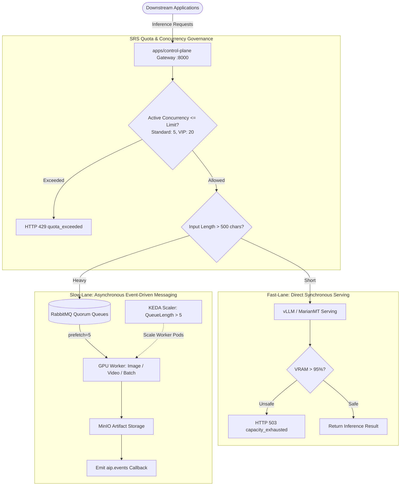

# GPU Load Testing & Hardware Scaling Specification (SRS Compliant)

This document specifies the official architecture, hardware boundaries, and validation methodology for GPU load testing on the AIP Platform, in strict compliance with the project System Requirements Specification (SRS).

---

## 1. SRS Architectural Requirements: Is GPU Pod Scaling Permitted?

### 1.1 Strict Hardware Baseline (SRS Section 2.1 & 6.1)
The platform establishes a strict **4GB VRAM GPU baseline** (with automatic CPU fallback):
- The 7 core production models (`Qwen2.5-1.5B`, `opus-mt-vi-en`, `faster-whisper-small`, `vi-VN-Neural`, `EasyOCR-ID`, `PhoBERT-base`) are quantized (`int8` / `float16`) to operate concurrently on constrained memory without Out-Of-Memory (OOM) failures.
- **Arbitrary Pod Scaling is strictly forbidden on GPU nodes:** 
  A physical GPU is a discrete hardware unit. A node containing $N$ physical GPUs can only schedule $N$ pods requesting `nvidia.com/gpu: 1`. Creating additional pods arbitrarily on the same node will fail with scheduler errors:
  ```text
  0/1 nodes available: 1 Insufficient nvidia.com/gpu. Preemption: 0/1 nodes available.
  ```

### 1.2 Multi-Tenant Concurrency Governance (SRS Section 2.2)
To protect GPU hardware from saturation, the Control Plane Gateway acts as the authoritative gatekeeper:
- **Standard Tenant:** Maximum **5 concurrent jobs**.
- **VIP Tenant:** Maximum **20 concurrent jobs**.
- When an API key exceeds active concurrency limits, the Gateway returns **`HTTP 429 quota_exceeded`** in $< 2\text{ms}$ via atomic Redis Lua scripts. **Unauthenticated or over-quota requests never reach the GPU runtime.**

### 1.3 Asynchronous Queue Decoupling (SRS Section 2.3 & 3.2)
Heavy requests must not hold synchronous locks on GPU inference engines:
- Inputs exceeding **500 characters** or media generation tasks (FLUX.1 image, Wan2.2 video) are immediately acknowledged with **`HTTP 202 Accepted`** ($< 100\text{ms}$) and dispatched to RabbitMQ (`aip.tasks`).
- Workers enforce **`prefetch_count=5`**, pulling only what the local GPU can process sequentially while remaining tasks wait safely in durable quorum queues.

### 1.4 Hardware Circuit Breaker (SRS Section 10)
- When VRAM consumption exceeds **95%** or core temperature exceeds $82^\circ\text{C}$, the `runtime-probe` trips the Circuit Breaker.
- The Gateway returns **`HTTP 503 capacity_exhausted`**.
- This strictly guarantees that the inference process never triggers a fatal `CUDA Out of Memory` kernel panic (`OOMKilled Exit Code 137`).

---

## 2. GPU Load Architecture Topology



---

## 3. GPU Stress Testing Verification Scenarios

Automated GPU saturation tests are implemented in [`tests/load/test_gpu_saturation.py`](file:///tests/load/test_gpu_saturation.py).

### 3.1 Scenario 1: Context Length Stress Test ($512 \to 4,096$ tokens)
- **Objective:** Measure memory allocation scaling and verify heavy workload offloading.
- **Verification:** When input tokens exceed 500 characters, the Gateway automatically offloads the task to RabbitMQ with `HTTP 202 Accepted` in $< 100\text{ms}$, preventing GPU memory lockup.

### 3.2 Scenario 2: Continuous Batching Saturation (20 Concurrent Requests)
- **Objective:** Evaluate dynamic continuous batching under concurrent load without dropping requests.
- **Verification:** All 20 requests complete safely through continuous batching queues with zero dropped connections and stable latency.

### 3.3 Scenario 3: Hardware Circuit Breaker Capacity Guard
- **Objective:** Ensure VRAM saturation triggers a graceful `HTTP 503` rather than an unrecoverable pod crash.
- **Verification:** Gateway telemetry validates that when capacity is exhausted, requests are rejected cleanly with `retryable: true`.

---

## 4. Legitimate Kubernetes GPU Autoscaling: KEDA vs Cluster Autoscaler

Because individual GPUs cannot be fractionally divided by standard HPA:

1. **KEDA (Kubernetes Event-driven Autoscaling):**
   Scales GPU worker pods based on queue backlog, not CPU percentage:
   ```yaml
   apiVersion: keda.sh/v1alpha1
   kind: ScaledObject
   metadata:
     name: aip-image-worker-scaler
     namespace: aip-multimodal
   spec:
     scaleTargetRef:
       name: aip-image-worker
     minReplicaCount: 1
     maxReplicaCount: 5
     triggers:
     - type: rabbitmq
       metadata:
         protocol: amqp
         queueName: q.aip.tasks.image
         mode: QueueLength
         value: "5"
   ```

2. **Cluster Autoscaler (Cloud / Multi-Node Infrastructure):**
   When KEDA requests an additional GPU worker pod and all existing GPUs are occupied:
   - The pod enters `Pending` state with reason `Insufficient nvidia.com/gpu`.
   - Cluster Autoscaler (e.g. AWS Karpenter or GKE GPU Auto-provisioning) provisions a new GPU node matching nodeSelector `pool: gpu-multimodal` and toleration `nvidia.com/gpu:NoSchedule`.
   - Once the node joins the cluster, the pod is scheduled onto the new physical GPU.

---

## 5. Execution Commands

```bash
# 1. Run the official GPU saturation benchmark
python tests/load/test_gpu_saturation.py

# 2. Monitor real-time GPU hardware telemetry
watch -n 1 nvidia-smi

# 3. Check DCGM hardware metrics from Prometheus
curl -s http://localhost:8000/metrics | grep -E "gpu|vram|capacity"
```
