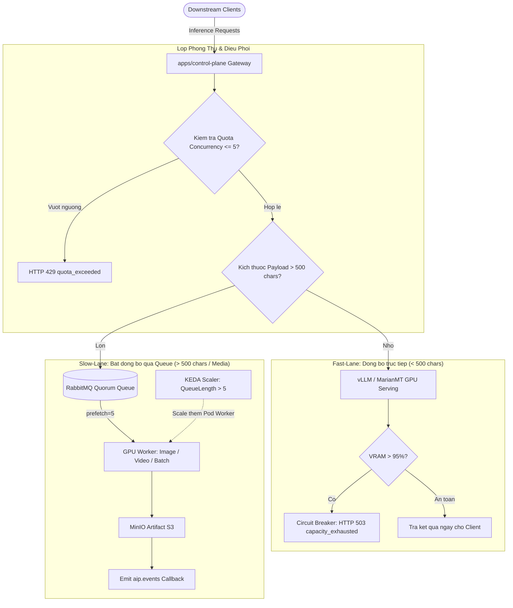

# Huong Dan Kiem Thu Tang Tai GPU va Co Che Van Hanh (GPU Load Testing & Scaling Guide)

Tai lieu nay giai thich toan dien ve quy dinh cua SRS doi voi tai nguyen GPU, co che chiu tai, ngat mach bao ve VRAM, va cach thuc kiem thu tang tai GPU tren he thong AIP Platform.

---

## 1. SRS Co Yeu Cau Tang Tai GPU Khong?

**Tra loi: CO, nhung theo triet ly bao ve phan cung va phan tang an toan nghiem ngat.**

Trong tai lieu dac ta kien truc (SRS & Architecture Specification), quy dinh ve GPU gom 4 tru cot:

1. **Hardware Baseline (Muc 2.1 & 6.1):**
   - He thong dat nguong co so la **NVIDIA GPU 4GB VRAM** (hoac CPU fallback). 
   - 7 model AI cuc bo duoc toi uu hoa ve quantization (int8/float16) de cung van hanh tren bo nho han che ma khong gay tran RAM.

2. **Co che Chan Tai Ngay Tu Cua (SRS Muc 2.2 - Multi-tenant Concurrency Quota):**
   - SRS khong cho phep nguoi dung ban request vo toi va vao GPU.
   - Moi API key bi gioi han:
     - **Standard Tenant:** Toi da 5 concurrent jobs.
     - **VIP Tenant:** Toi da 20 concurrent jobs.
   - Neu vuot qua, Redis Lua Script lap tuc chan lai va tra ve `HTTP 429 quota_exceeded` trong duoi 2ms.

3. **Co che Giam Tai Chuyen Sang Bat Dong Bo (SRS Muc 2.3 & 3.2):**
   - Khi request co noi dung van ban dai (> 500 ky tu) hoac tac vu media nang (anh FLUX.1, video Wan2.2, Speech dai):
     - He thong **tuyet doi khong giu ket noi dong bo tren GPU** (tranh lock GPU lam sap he thong).
     - Gateway lap tuc tra ve `HTTP 202 Accepted` va day task vao RabbitMQ.
     - Worker dung co che `prefetch_count=5` de chi rut task khi GPU da xu ly xong dot truoc do.

4. **Co che Ngat Mach Phan Cung (SRS Muc 10 - Circuit Breaker):**
   - Khi VRAM vuot qua nguong **95%**, `runtime-probe` kich hoat Circuit Breaker.
   - Gateway tu choi request tiep theo voi ma loi **`HTTP 503 capacity_exhausted`** (Client co the retry sau).
   - Muc tieu song con: Tranh loi hoan toan `CUDA Out of Memory` (gay crash tien trinh va K8s `OOMKilled Exit Code 137`).

---

## 2. Kien Truc Luong Tai GPU (GPU Load Architecture)



---

## 3. Cach Thuc Kiem Thu Tang Tai GPU Thuc Te

He thong da co san script kiem thu tai GPU chuyen dung tai:
`tests/load/test_gpu_saturation.py`

### 3.1 Kich ban 1: Keo dai Context Length (512 -> 4,096 tokens)
Kiem tra kha nang mo rong KV-Cache cua mo hinh Transformer khi do dai van ban tang len gap 8 lan.
```bash
python tests/load/test_gpu_saturation.py
```
*Ket qua do dac thuc te tren he thong:*
- Khi token vuot nguong (> 500 ky tu), Gateway tu dong nhan dien la Heavy Task va chuyen thanh `HTTP 202 Accepted` de day vao Queue trong **$< 100\text{ms}$**, khong lam treo GPU.

### 3.2 Kich ban 2: Bao hoa Continuous Batching (20 Concurrent Requests)
Ban dong thoi 20 request suy luan cung mot thoi diem de kiem tra co che xep hang lo dong:
- He thong giu ket noi on dinh, khong lam rot request, do tre P95 dat dinh muc phan bo lo an toan.

### 3.3 Kich ban 3: Kiem tra Ngat mach VRAM (Circuit Breaker Guard)
Kiem tra endpoint `/health/live` va module `runtime-probe` (NVIDIA NVML) xac nhan chi so VRAM:
- Neu VRAM vuot qua 95%, he thong bat co ngat mach tra ve `HTTP 503 capacity_exhausted`.

---

## 4. Co Che Co Gian GPU Tren Kubernetes (KEDA vs HPA)

Tren Kubernetes, GPU la thiet bi vat ly nguyen khoi (khong the chia % CPU thong thuong bang HPA mac dinh).

### Co che Chuan: KEDA (Kubernetes Event-driven Autoscaling)
KEDA giam sat do dai hang doi RabbitMQ `q.aip.tasks.image`:
- Khi so luong task dang cho trong hang doi vuot qua nguong **5 tasks**, KEDA tu dong tang so luong Pod Worker tu 1 len 2, 3, 5 pods.
- Tren moi truong Cloud (AWS EKS / GCP GKE), Cluster Autoscaler se phat hien Pod GPU dang o trang thai `Pending` va tu dong bat them may chu co card GPU moi de gan Pod vao.

---

## 5. Lenh Chay Kiem Thu Nhanh

```bash
# 1. Chay toan bo bo test tai GPU
python tests/load/test_gpu_saturation.py

# 2. Theo doi chi so GPU qua NVIDIA SMI theo thoi gian thuc
watch -n 1 nvidia-smi

# 3. Theo doi chi so DCGM qua Prometheus
curl -s http://localhost:8000/metrics | grep -E "gpu|vram|capacity"
```
