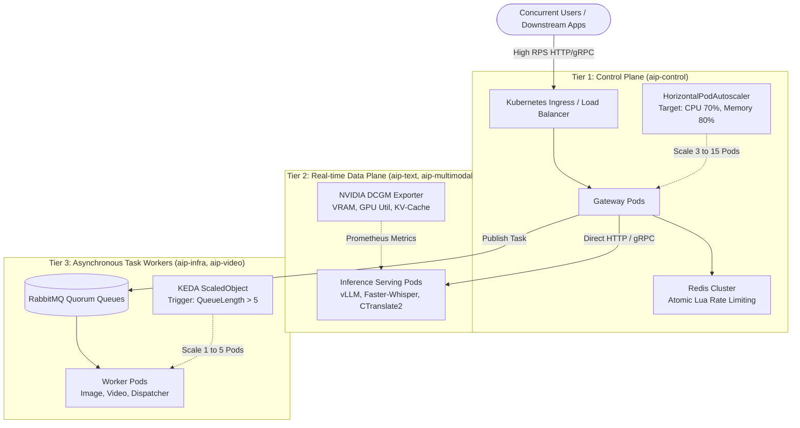

# Kubernetes Load & Stress Testing Guide for AIP Platform

This document provides a comprehensive operational guide for load testing, stress testing, and auto-scaling verification on Kubernetes clusters for the AIP Platform.

---

## 1. Overview & Architecture

AIP Platform implements a 3-tier architecture with distinct scaling dimensions:



---

## 2. Cluster Prerequisites & Initial Setup

### 2.1 Verify Cluster Connection
Ensure your `kubectl` context points to your target cluster (e.g. `kind`, EKS, GKE, or On-Premises Kube):
```bash
kubectl cluster-info
kubectl get nodes
```

### 2.2 Install Metrics Server
The Kubernetes Horizontal Pod Autoscaler (HPA) requires `metrics-server` to sample CPU and Memory metrics:
```bash
# 1. Install metrics-server components
kubectl apply -f https://github.com/kubernetes-sigs/metrics-server/releases/latest/download/components.yaml

# 2. For local clusters (kind / Docker Desktop), enable insecure TLS for self-signed certificates
kubectl patch deployment metrics-server -n kube-system --type 'json' \
  -p '[{"op": "add", "path": "/spec/template/spec/containers/0/args/-", "value": "--kubelet-insecure-tls"}]'

# 3. Verify metrics collection (wait ~30 seconds for first sample)
kubectl top nodes
```

### 2.3 Initialize Namespaces & Secrets
```bash
kubectl apply -f deploy/k8s/namespaces/namespaces.yaml
kubectl apply -f deploy/k8s/secrets/secrets.yaml
```

---

## 3. Load Test Type 1: High User Concurrency & RPS (Control Plane Scaling)

### 3.1 Objective
Verify that the API Gateway can handle hundreds to thousands of concurrent users, that Horizontal Pod Autoscaler (HPA) automatically scales pods up and down, and that multi-tenant rate limits (HTTP 429) protect backend resources from denial-of-service.

### 3.2 Deploy Control Plane with HPA
Deploy the gateway chart with autoscaling enabled:
```bash
helm upgrade --install aip-control deploy/helm/aip-control \
  --namespace aip-control \
  --set nodeSelector=null \
  --set autoscaling.enabled=true \
  --set autoscaling.minReplicas=2 \
  --set autoscaling.maxReplicas=10 \
  --set autoscaling.targetCPUUtilizationPercentage=70 \
  --set autoscaling.targetMemoryUtilizationPercentage=80
```

Verify HPA is active:
```bash
kubectl get hpa -n aip-control
```

### 3.3 Test Execution

#### Method A: Internal Async Python Test Suite
Run the built-in async benchmark tool:
```bash
python tests/load/test_user_concurrency.py
```
This tests:
- 50 concurrent virtual users querying health probes.
- 40 concurrent virtual users navigating API catalogs.
- Measures P50, P95, and P99 latency percentiles and RPS throughput.

#### Method B: High-Concurrency k6 Load Test
Port-forward the Gateway service or point directly to Ingress:
```bash
# Terminal 1: Port-forward service to localhost:8000
kubectl port-forward svc/aip-control-gateway 8000:8000 -n aip-control

# Terminal 2: Run k6 load test script
k6 run deploy/k6/load_users_k6.js
```

Or target a remote Ingress IP:
```bash
k6 run -e TARGET_URL=http://<INGRESS_IP> -e API_KEY=aip_live_testkey123 deploy/k6/load_users_k6.js
```

### 3.4 Operational Mechanism of HPA & Rate Limiting

#### 1. HPA Metric Evaluation & Scaling Formula
Kubernetes `metrics-server` samples CPU/Memory every 15 seconds. HPA calculates desired replicas via:
$$\text{DesiredReplicas} = \left\lceil \text{CurrentReplicas} \times \left( \frac{\text{CurrentMetricValue}}{\text{DesiredMetricValue}} \right) \right\rceil$$

- **Scale-Up Behavior (`stabilizationWindowSeconds: 0`)**:
  When load surges, HPA triggers scale-up immediately without delay. It can double replicas every 15 seconds (up to `maxReplicas: 10`).
- **Scale-Down Behavior (`stabilizationWindowSeconds: 300`)**:
  When traffic subsides, HPA holds the replica count for 5 minutes (300s) to prevent "flapping" (rapid oscillations of pod creation and deletion).

#### 2. Redis Atomic Lua Rate Limiting
To prevent race conditions during high concurrency:
- Every incoming request executes an atomic Lua script inside Redis RAM.
- Tokens (RPM) and active concurrency slots are checked and incremented in `< 1ms`.
- If limit is exceeded, HTTP 429 (`rate_limit_exceeded`) is returned instantly, dropping invalid load before it impacts compute nodes.

---

## 4. Load Test Type 2: GPU Compute & VRAM Saturation (Data Plane Scaling)

### 4.1 Objective
Measure hardware saturation boundaries on GPU inference nodes: VRAM capacity, KV-Cache memory exhaustion, batching queue depth, and automated worker scale-out.

### 4.2 Key Metrics to Monitor (NVIDIA DCGM / Prometheus)
| Metric | Description | Critical Threshold |
| --- | --- | :---: |
| `DCGM_FI_DEV_GPU_UTIL` | GPU Core Compute Utilization | > 90% |
| `DCGM_FI_DEV_FB_USED` | GPU VRAM Allocated Memory | > 92% of Total |
| `DCGM_FI_DEV_GPU_TEMP` | GPU Core Temperature | > 82°C (Thermal Throttling) |
| `vllm:num_requests_waiting` | Queued LLM requests waiting for KV-Cache | > 10 requests |
| `vllm:gpu_cache_usage_factor` | KV-Cache memory block utilization | > 0.90 |

### 4.3 Test Scenarios

#### Scenario 1: Input Context Length Stress Test
Send sequential requests with increasing input token length (512 -> 2,048 -> 8,000 tokens) to observe KV-cache allocation:
```bash
curl -X POST "http://localhost:8000/v1/nlp/summarize" \
  -H "Authorization: Bearer aip_live_testkey123" \
  -H "Content-Type: application/json" \
  -d '{"document": "<REPEATED_LONG_DOCUMENT_TEXT>", "ratio": 0.2}'
```

#### Scenario 2: Continuous Batching Saturation
Simulate 20 concurrent requests generating 500 completion tokens each. Monitor `vllm:num_requests_waiting`. The engine will continuously batch requests up to maximum batch capacity.

#### Scenario 3: Circuit Breaker & Capacity Exhaustion
When VRAM reaches the safety margin (> 95%), verify that `runtime-probe` triggers the Circuit Breaker:
- Gateway returns `HTTP 503 capacity_exhausted`.
- The pod avoids an unrecoverable `CUDA Out Of Memory` kernel panic (`OOMKilled Exit Code 137`).

### 4.4 Event-Driven Autoscaling (KEDA) for GPU Workers
For asynchronous GPU tasks (image, video, speech), configure KEDA to scale pods based on RabbitMQ queue depth:
```yaml
apiVersion: keda.sh/v1alpha1
kind: ScaledObject
metadata:
  name: aip-image-worker-scaler
  namespace: aip-multimodal
spec:
  scaleTargetRef:
    name: aip-image-worker
  minReplicaCount: 1
  maxReplicaCount: 5
  triggers:
  - type: rabbitmq
    metadata:
      protocol: amqp
      queueName: q.aip.tasks.image
      mode: QueueLength
      value: "5"
```
When more than 5 jobs wait in queue, KEDA increments worker replicas.

---

## 5. Enterprise Must-Test Scenarios

### 5.1 RabbitMQ Queue Backpressure & Spike Test
- **Execution:** Publish 5,000 tasks within 10 seconds into `aip.tasks`.
- **Validation:**
  - Verify workers respect `prefetch_count=5` and do not overload GPU RAM.
  - Quorum queues guarantee zero message loss during peak ingestion.
  - Tasks failing maximum retries route to `q.aip.tasks.dlq`.

### 5.2 Soak / Longevity Testing (Memory Leak Verification)
- **Execution:** Run continuous 50% capacity load for 8 to 24 hours.
- **Validation:**
  - Control Plane RSS memory must plateau (no progressive increase).
  - PyTorch CUDA memory caching must stabilize without memory fragmentation.

### 5.3 Chaos Engineering Under Heavy Load
- **Execution:** While running 80% RPS load, terminate a pod:
  ```bash
  kubectl delete pod -l app=aip-control-gateway -n aip-control
  ```
- **Validation:**
  - Kubernetes `/health/ready` probe detects termination and removes pod from EndpointSlice within 3 seconds.
  - Ingress routes traffic to surviving pods with zero dropped connections.
  - Stale background jobs (> 15m) are auto-reconciled by `StaleReconciler`.

### 5.4 Database Connection Pool Stress
- **Execution:** 1,000 concurrent requests writing audit logs and token usage records.
- **Validation:**
  - Motor / MongoDB connection pool does not throw `ServerSelectionTimeoutError`.
  - Asynchronous background tasks (`asyncio.create_task`) decouple log persistence from client response time.

---

## 6. Real-Time Cluster Monitoring Commands

```bash
# Monitor HPA scaling events in real-time
kubectl get hpa -n aip-control -w

# Monitor Pod resource consumption
kubectl top pods -n aip-control

# Check events for scale-up / scale-down actions
kubectl get events -n aip-control --sort-by='.lastTimestamp'

# View Gateway access and latency logs
kubectl logs -f -l app.kubernetes.io/name=aip-gateway -n aip-control --tail=50
```
