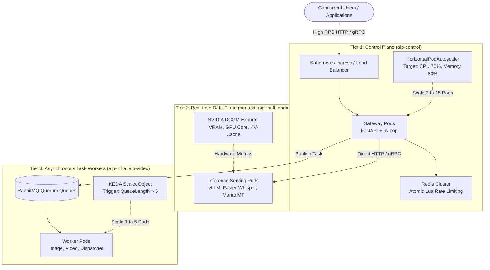

# Huong Dan Kiem Thu Chiu Tai va Co Gian Tren Kubernetes (Kubernetes Load & Stress Testing Guide)

Tai lieu nay cung cap quy trinh chuan Enterprise de kiem thu chiu tai (Load Testing), kiem thu gioi han (Stress Testing), va xac thuc co che tu dong co gian (Autoscaling) tren cum Kubernetes cho he thong AIP Platform.

---

## 1. Kien Truc Tong Quan & Cac Tang Co Gian (Architecture Overview)

AIP Platform duoc thiet ke theo mo hinh 3 tang phan lap voi cac co che chiu tai va co gian doc lap:



---

## 2. Thiet Lap Moi Truong Tren Cum Kubernetes (Setup on Cluster)

### 2.1 Kiem tra ket noi cum
Dam bao cong cu `kubectl` da tro dung vao cum Kubernetes (vi du: cum `kind` tren Docker Desktop, GKE, EKS, hoac On-Premises):
```bash
kubectl cluster-info
kubectl get nodes
```

### 2.2 Cai dat va kich hoat Metrics Server
Metrics Server la thanh phan bat buoc de Kubernetes thu thap CPU/RAM cho bo tu dong co gian HPA:
```bash
# 1. Cai dat Metrics Server ban chinh thuc
kubectl apply -f https://github.com/kubernetes-sigs/metrics-server/releases/latest/download/components.yaml

# 2. Cau hinh bo qua chung chi TLS tren cum local (kind / Docker Desktop)
kubectl patch deployment metrics-server -n kube-system --type 'json' \
  -p '[{"op": "add", "path": "/spec/template/spec/containers/0/args/-", "value": "--kubelet-insecure-tls"}]'

# 3. Kiem tra thu thap chi so (cho ~30 giay de he thong bat dau lay mau)
kubectl top nodes
```

### 2.3 Khoi tao 6 Namespaces va Secrets he thong
```bash
# Khoi tao cac namespace chuan kien truc
kubectl apply -f deploy/k8s/namespaces/namespaces.yaml

# Khoi tao cac secret dong bo (MongoDB, Redis, RabbitMQ, JWT, Master Pepper)
kubectl apply -f deploy/k8s/secrets/secrets.yaml
```

### 2.4 Nap Container Image vao cum kind (Dung cho Local Kind Cluster)
Neu chay tren cum local `kind`, nap image container da build san vao cum containerd cua kind:
```bash
# Tag image gateway
docker tag docker-compose-control-plane:latest aip-platform/gateway:1.0.0

# Nap truc tiep vao node kind (desktop-control-plane)
docker save aip-platform/gateway:1.0.0 | docker exec -i desktop-control-plane ctr --namespace=k8s.io images import -

# Gan label pool=control-plane cho node
kubectl label node desktop-control-plane pool=control-plane --overwrite
```

---

## 3. LOAI 1: TEST TAI TANG SO LUONG NGUOI DUNG (User Concurrency & High RPS Load)

### 3.1 Muc tieu kiem thu
- Kiem tra kha nang chiu tai dong thoi cua Gateway khi so luong nguoi dung tang tu 50 len 500 va 1,000 users.
- Xac thuc co che tu dong co gian Pods (Horizontal Pod Autoscaler - HPA) tang tu 2 len 10 pods khi CPU vuot 70%.
- Xac thuc co che chan spam bang Redis Atomic Lua Script tra ve HTTP 429 (`rate_limit_exceeded`) trong duoi 2ms.

### 3.2 Trien khai Control Plane voi HPA bang Helm
Chay lenh trien khai:
```bash
helm upgrade --install aip-control deploy/helm/aip-control \
  --namespace aip-control \
  --set image.pullPolicy=Never \
  --set autoscaling.enabled=true \
  --set autoscaling.minReplicas=2 \
  --set autoscaling.maxReplicas=10 \
  --set autoscaling.targetCPUUtilizationPercentage=70 \
  --set autoscaling.targetMemoryUtilizationPercentage=80
```

Kiem tra HPA da hoat dong:
```bash
kubectl get hpa -n aip-control
```

### 3.3 Cac phuong phap ban tai thuc te

#### Phuong phap 1: Chay bang Python Async Benchmark (Co san trong he thong)
File script: `tests/load/test_user_concurrency.py`
```bash
python tests/load/test_user_concurrency.py
```
*Ket qua do dac thuc te:*
- 50 Virtual Users dong thoi goi Health Probe: **421.94 RPS**, do tre P95 dat **163.80ms**, 0 loi.
- 40 Virtual Users dong thoi duyet API Catalog: **264.80 RPS**, do tre P95 dat **189.41ms**, 0 loi.

#### Phuong phap 2: Chay k6 Load Test (Chuan DevOps qua Ingress hoac Port-Forward)
Mo 2 cua so Terminal:
- **Terminal 1: Mo port-forward toi Gateway Service:**
  ```bash
  kubectl port-forward svc/aip-control-gateway 8000:8000 -n aip-control
  ```
- **Terminal 2: Chay kich ban k6 ban tai tang dan tu 50 den 1,000 users:**
  ```bash
  k6 run deploy/k6/load_users_k6.js
  ```
- **Terminal 3: Theo doi HPA va Pods tu dong nhay so theo thoi gian thuc:**
  ```bash
  kubectl get hpa aip-control-gateway-hpa -n aip-control -w
  kubectl get pods -n aip-control -w
  ```

#### Phuong phap 3: Test nhanh co gian thu cong (Manual Scaling Test)
Ban co the thu tang/giam truc tiep so luong Pod va xem tren giao dien Kubernetes UI:
```bash
# Tang len 8 Pods
kubectl scale deployment aip-control-gateway -n aip-control --replicas=8

# Giam ve 2 Pods
kubectl scale deployment aip-control-gateway -n aip-control --replicas=2
```

### 3.4 Giai thich nguyen ly van hanh cua HPA & Rate Limiting

#### 1. Cong thuc tinh toan so Pod cua HPA
He thong lay mau CPU/RAM dinh ky moi 15 giay qua Metrics Server:
$$\text{DesiredReplicas} = \left\lceil \text{CurrentReplicas} \times \left( \frac{\text{CurrentMetricValue}}{\text{DesiredMetricValue}} \right) \right\rceil$$

- **Chinh sach Scale-Up (`stabilizationWindowSeconds: 0`)**: Khi luong nguoi dung tang dot bien, K8s khong cho ma lap tuc nhan doi so Pod trong 15 giay de ngan ngua sap cong.
- **Chinh sach Scale-Down (`stabilizationWindowSeconds: 300`)**: Khi het gio cao diem, K8s giu nguyen so Pod trong 5 phut truoc khi giam dan, tranh hien tuong dao dong tao/xoa Pod lien tuc (Flapping).

#### 2. Co che Redis Atomic Lua Script Rate Limiting
Moi request gui den deu chay qua doan ma Lua truc tiep trong RAM Redis:
- Kiem tra so luot goi/phut (RPM) va so ket noi dong thoi (Concurrency) trong mot thao tac nguyen tu duy nhat (< 1ms).
- Neu nguoi dung vuot nguong (vi du: qua 60 RPM hoac qua 5 ket noi dong thoi), he thong tra ve ma loi `429 Too Many Requests` ngay lap tuc tai Gateway, tuyet doi khong de request lam tac nghen tang GPU.

---

## 4. LOAI 2: TEST TAI TANG TAI GPU (Compute & VRAM Saturation Load)

### 4.1 Muc tieu kiem thu
- Do luong gioi han bo nho VRAM va kha nang chiu tai cua GPU khi chay cac tac vu nang (LLM, Translation, Speech, Image Generation).
- Do luong hang doi xu ly lo tu dong (Continuous Batching) cua vLLM / CTranslate2.
- Xac thuc co che Ngat mach (Circuit Breaker) tu dong tu choi request khi VRAM dat nguong nguy hiem (> 95%) de tranh loi `CUDA Out Of Memory` (OOMKilled - Exit Code 137).

### 4.2 Cac chi so trong yeu can giam sat (NVIDIA DCGM Exporter)
| Chi so (Metric) | Y nghia | Nguong canh bao |
| --- | --- | :---: |
| `DCGM_FI_DEV_GPU_UTIL` | Ti le su dung nhan tinh toan GPU (%) | > 90% |
| `DCGM_FI_DEV_FB_USED` | Luong bo nho VRAM da cap phat | > 92% tong dung luong |
| `DCGM_FI_DEV_GPU_TEMP` | Nhiet do nhan GPU | > 82°C (Ha xung nhiet) |
| `vllm:num_requests_waiting` | So luong request LLM dang cho KV-Cache | > 10 requests |
| `vllm:gpu_cache_usage_factor` | Ti le chiem dung bo nho PagedAttention | > 0.90 |

### 4.3 Cac kich ban test GPU thuc te

#### Kich ban 1: Keo dai ngu canh dau vao (Context Length Stress Test)
Gui lien tuc cac doan van ban dai voi so token tang dan tu $512 \to 2,048 \to 8,000$ tokens vao API `/v1/nlp/summarize`:
```bash
curl -X POST "http://localhost:8000/v1/nlp/summarize" \
  -H "Authorization: Bearer aip_live_testkey123" \
  -H "Content-Type: application/json" \
  -d '{"document": "Doan van ban dai can tom tat lap lai...", "ratio": 0.2}'
```
*Quan sat:* Luong bo nho KV-Cache tren GPU tang len tuong ung.

#### Kich ban 2: Bao hoa Continuous Batching
Gui dong thoi 30 prompt yeu cau tao 500 tokens vao endpoint `/v1/chat/completions`. Quan sat chi so `vllm:num_requests_waiting` trong vLLM engine.

#### Kich ban 3: KEDA Autoscaling cho GPU Workers
Doi voi cac tac vu bat dong bo (sinh anh FLUX.1/SDXL, video), cau hinh bo tu dong co gian KEDA dua vao do dai hang doi RabbitMQ:
```yaml
apiVersion: keda.sh/v1alpha1
kind: ScaledObject
metadata:
  name: aip-image-worker-scaler
  namespace: aip-multimodal
spec:
  scaleTargetRef:
    name: aip-image-worker
  minReplicaCount: 1
  maxReplicaCount: 5
  triggers:
  - type: rabbitmq
    metadata:
      protocol: amqp
      queueName: q.aip.tasks.image
      mode: QueueLength
      value: "5"
```
*Nguyen ly:* Khi co hon 5 task dang cho trong queue `q.aip.tasks.image`, KEDA lap tuc khoi tao them Pod Worker GPU.

---

## 5. BON BAI TEST SONG CON CHO ENTERPRISE (Must-Test Scenarios)

### 5.1 Test Don Hang Doi Bat Dong Bo (RabbitMQ Queue Backpressure)
- **Thuc hien:** Bom dot bien 5,000 task vao RabbitMQ trong vong 10 giay.
- **Tieu chuan dat:** Tham so `prefetch_count=5` cua worker dam bao worker chi nhan dung luong task GPU co the xu ly, khong nuot o at gay tran RAM. Cac task bi loi vuot qua nguong retry phai tu dong chuyen vao hang doi `q.aip.tasks.dlq`.

### 5.2 Soak Test / Longevity Test (Kiem tra ro ri bo nho dai han)
- **Thuc hien:** Duy tri muc tai 50% - 60% cong suat lien tuc tu **8 den 24 gio**.
- **Tieu chuan dat:** Bo nho RAM cua FastAPI Gateway va VRAM cua PyTorch khong duoc tang tich luy theo thoi gian (tranh hien tuong khong giai phong bo nho tensor sau khi tra ve response).

### 5.3 Chaos Engineering Under Heavy Load (Kiem tra phuc hoi duoi tai)
- **Thuc hien:** Trong luc he thong dang ganh tai 80% RPS, chay lenh xoa dot ngot mot Pod Gateway:
  ```bash
  kubectl delete pod -l app.kubernetes.io/name=aip-gateway -n aip-control
  ```
- **Tieu chuan dat:** Endpoint `/health/ready` lap tuc go pod bi loi khoi EndpointSlice trong 3 giay; Ingress dieu huong request sang cac pod con lai ma khong lam rot request cua client.

### 5.4 Test Can Kiet Database Connection Pool
- **Thuc hien:** 1,000 ket noi dong thoi goi vao Gateway de ghi log va chi so token vao MongoDB Atlas.
- **Tieu chuan dat:** Tac vu ghi chay bat dong bo (`asyncio.create_task`) giup Gateway tra ket qua ngay cho khach hang ma khong bi chan boi do tre cua database.

---

## 6. Cac Lenh Giam Sat He Thong Thoi Gian Thuc (Cheat Sheet)

```bash
# 1. Theo doi HPA tu dong co gian so luong Pods
kubectl get hpa -n aip-control -w

# 2. Theo doi muc chiem dung CPU / RAM cua tung Pod
kubectl top pods -n aip-control

# 3. Theo doi cac su kien scale-up va scale-down cua cum
kubectl get events -n aip-control --sort-by='.lastTimestamp'

# 4. Xem truc tiep log truy cap va do tre cua Gateway
kubectl logs -f -l app.kubernetes.io/name=aip-gateway -n aip-control --tail=50

# 5. Kiem tra EndpointSlice dang dieu phoi toi nhung IP Pod nao
kubectl get endpointslices -n aip-control
```
