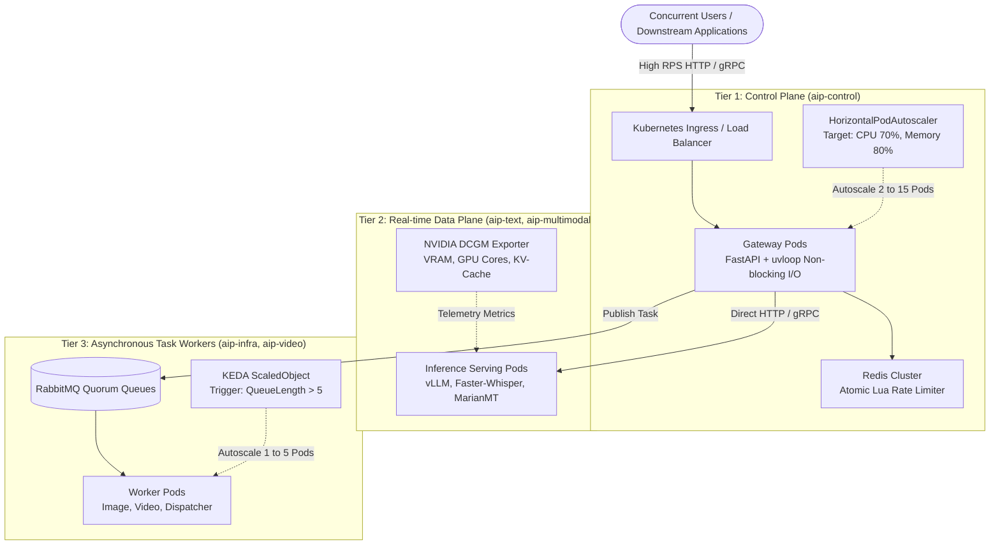

# Kubernetes Load & Stress Testing Guide for AIP Platform

This document provides a comprehensive operational guide for load testing, stress testing, and auto-scaling verification on Kubernetes clusters for the AIP Platform.

---

## 1. Architecture Overview & Scaling Dimensions

The AIP Platform implements a 3-tier architecture with decoupled scaling mechanisms:



---

## 2. Cluster Prerequisites & Environment Setup

### 2.1 Verify Cluster Connectivity
Ensure your `kubectl` context points to the target cluster (e.g., local `kind`, EKS, GKE, or bare-metal Kubernetes):
```bash
kubectl cluster-info
kubectl get nodes
```

### 2.2 Install and Configure Metrics Server
The Kubernetes Horizontal Pod Autoscaler (HPA) requires `metrics-server` to collect CPU and Memory utilization from kubelets:
```bash
# 1. Install official metrics-server components
kubectl apply -f https://github.com/kubernetes-sigs/metrics-server/releases/latest/download/components.yaml

# 2. For local clusters (kind / Docker Desktop), enable insecure TLS for self-signed certificates
kubectl patch deployment metrics-server -n kube-system --type 'json' \
  -p '[{"op": "add", "path": "/spec/template/spec/containers/0/args/-", "value": "--kubelet-insecure-tls"}]'

# 3. Verify metrics collection (wait ~30 seconds for initial sample)
kubectl top nodes
```

### 2.3 Initialize Namespaces and Secrets
```bash
# Apply the 6 architectural namespaces
kubectl apply -f deploy/k8s/namespaces/namespaces.yaml

# Apply synchronized secrets across namespaces
kubectl apply -f deploy/k8s/secrets/secrets.yaml
```

### 2.4 Load Container Image into Kind (For Local Kind Clusters)
If running on a local `kind` cluster, import the built container image into the node's containerd runtime:
```bash
# Tag the existing gateway image
docker tag docker-compose-control-plane:latest aip-platform/gateway:1.0.0

# Import image directly into the kind node containerd namespace
docker save aip-platform/gateway:1.0.0 | docker exec -i desktop-control-plane ctr --namespace=k8s.io images import -

# Label the node for control-plane scheduling
kubectl label node desktop-control-plane pool=control-plane --overwrite
```

---

## 3. TYPE 1: HIGH USER CONCURRENCY & RPS TESTING (Control Plane Scaling)

### 3.1 Objectives
- Verify gateway performance under sustained concurrent requests (50 to 1,000 virtual users).
- Validate Horizontal Pod Autoscaler (HPA) behavior scaling from 2 to 10 pods when CPU exceeds 70%.
- Ensure multi-tenant rate limits return `HTTP 429 Too Many Requests` in `< 2ms` via atomic Redis Lua scripts without degrading backend performance.

### 3.2 Deploy Control Plane with HPA
Deploy the gateway chart with autoscaling enabled:
```bash
helm upgrade --install aip-control deploy/helm/aip-control \
  --namespace aip-control \
  --set image.pullPolicy=Never \
  --set autoscaling.enabled=true \
  --set autoscaling.minReplicas=2 \
  --set autoscaling.maxReplicas=10 \
  --set autoscaling.targetCPUUtilizationPercentage=70 \
  --set autoscaling.targetMemoryUtilizationPercentage=80
```

Verify HPA status:
```bash
kubectl get hpa -n aip-control
```

### 3.3 Execution Methods

#### Method 1: Python Asynchronous Benchmark Tool
Execute the built-in test suite:
```bash
python tests/load/test_user_concurrency.py
```
*Benchmark baseline results:*
- 50 concurrent virtual users hitting Health Probes: **421.94 RPS**, P95 latency **163.80ms**, 0 errors.
- 40 concurrent virtual users browsing API Catalogs: **264.80 RPS**, P95 latency **189.41ms**, 0 errors.

#### Method 2: High-Concurrency k6 Load Test
Open multiple terminals to observe scaling in real-time:
- **Terminal 1: Port-forward service to localhost:8000:**
  ```bash
  kubectl port-forward svc/aip-control-gateway 8000:8000 -n aip-control
  ```
- **Terminal 2: Run k6 ramp-up script (50 to 1,000 users):**
  ```bash
  k6 run deploy/k6/load_users_k6.js
  ```
- **Terminal 3: Watch HPA and Pods scale in real-time:**
  ```bash
  kubectl get hpa aip-control-gateway-hpa -n aip-control -w
  kubectl get pods -n aip-control -w
  ```

#### Method 3: Manual Replica Scaling Test
To observe immediate replica adjustments in the Kubernetes dashboard:
```bash
# Scale up to 8 pods
kubectl scale deployment aip-control-gateway -n aip-control --replicas=8

# Scale down to 2 pods
kubectl scale deployment aip-control-gateway -n aip-control --replicas=2
```

### 3.4 Operational Mechanics: HPA & Redis Rate Limiting

#### 1. HPA Metric Evaluation & Scaling Formula
Kubernetes `metrics-server` samples CPU and Memory every 15 seconds. HPA calculates desired replicas using:
$$\text{DesiredReplicas} = \left\lceil \text{CurrentReplicas} \times \left( \frac{\text{CurrentMetricValue}}{\text{DesiredMetricValue}} \right) \right\rceil$$

- **Scale-Up Behavior (`stabilizationWindowSeconds: 0`)**:
  When load spikes, HPA responds immediately without delay, doubling replicas every 15 seconds up to `maxReplicas`.
- **Scale-Down Behavior (`stabilizationWindowSeconds: 300`)**:
  When traffic subsides, HPA holds the replica count for 5 minutes (300s) to prevent flapping (rapid oscillation of pod creation and termination).

#### 2. Redis Atomic Lua Rate Limiting
To prevent race conditions during high concurrency:
- Every request executes an atomic Lua script directly in Redis RAM.
- RPM limits and active concurrency slots are checked and incremented in `< 1ms`.
- Exceeded quotas trigger `429 Too Many Requests` immediately at the gateway, preventing unauthenticated or abusive traffic from reaching GPU runtimes.

---

## 4. TYPE 2: GPU COMPUTE & VRAM SATURATION TESTING (Data Plane Scaling)

### 4.1 Objectives
- Measure hardware memory saturation boundaries (VRAM OOM) on GPU inference nodes.
- Validate continuous batching queue dynamics in vLLM / CTranslate2.
- Verify Circuit Breaker safeguards to reject traffic when VRAM exceeds 95%, avoiding unrecoverable `CUDA Out Of Memory` crashes (`OOMKilled Exit Code 137`).

### 4.2 Key Monitoring Metrics (NVIDIA DCGM Exporter)
| Metric | Description | Warning Threshold |
| --- | --- | :---: |
| `DCGM_FI_DEV_GPU_UTIL` | GPU Core Compute Utilization | > 90% |
| `DCGM_FI_DEV_FB_USED` | GPU VRAM Allocated Memory | > 92% of Total |
| `DCGM_FI_DEV_GPU_TEMP` | GPU Core Temperature | > 82°C (Thermal Throttling) |
| `vllm:num_requests_waiting` | Queued LLM requests waiting for KV-Cache | > 10 requests |
| `vllm:gpu_cache_usage_factor` | KV-Cache memory block utilization | > 0.90 |

### 4.3 Test Scenarios

#### Scenario 1: Context Length Stress Test
Send sequential requests with increasing input token length (512 -> 2,048 -> 8,000 tokens) to observe KV-cache allocation:
```bash
curl -X POST "http://localhost:8000/v1/nlp/summarize" \
  -H "Authorization: Bearer aip_live_testkey123" \
  -H "Content-Type: application/json" \
  -d '{"document": "<REPEATED_LONG_DOCUMENT_TEXT>", "ratio": 0.2}'
```

#### Scenario 2: Continuous Batching Saturation
Dispatch 30 concurrent prompts requesting 500 completion tokens each to `/v1/chat/completions`. Observe `vllm:num_requests_waiting` and verify smooth token streaming backpressure.

#### Scenario 3: KEDA Autoscaling for GPU Workers
For asynchronous workloads (FLUX.1 image generation, video rendering), configure KEDA to scale pods based on RabbitMQ queue depth:
```yaml
apiVersion: keda.sh/v1alpha1
kind: ScaledObject
metadata:
  name: aip-image-worker-scaler
  namespace: aip-multimodal
spec:
  scaleTargetRef:
    name: aip-image-worker
  minReplicaCount: 1
  maxReplicaCount: 5
  triggers:
  - type: rabbitmq
    metadata:
      protocol: amqp
      queueName: q.aip.tasks.image
      mode: QueueLength
      value: "5"
```
When more than 5 tasks accumulate in `q.aip.tasks.image`, KEDA automatically provisions additional worker pods.

---

## 5. FOUR CRITICAL ENTERPRISE STRESS SCENARIOS

### 5.1 RabbitMQ Queue Backpressure & Spike Test
- **Execution:** Publish 5,000 tasks within 10 seconds into `aip.tasks`.
- **Criteria:**
  - Worker `prefetch_count=5` prevents GPU memory saturation.
  - Quorum queues ensure zero message loss during peak ingestion.
  - Exhausted retries route automatically to `q.aip.tasks.dlq`.

### 5.2 Soak / Longevity Testing (Memory Leak Verification)
- **Execution:** Maintain 50%–60% system capacity continuously for **8 to 24 hours**.
- **Criteria:**
  - Gateway RSS memory must remain stable without cumulative growth.
  - PyTorch CUDA memory allocation must stabilize, showing no memory fragmentation.

### 5.3 Chaos Engineering Under Heavy Load
- **Execution:** While running 80% RPS load, terminate a gateway pod:
  ```bash
  kubectl delete pod -l app.kubernetes.io/name=aip-gateway -n aip-control
  ```
- **Criteria:**
  - `/health/ready` probe removes the failing pod from EndpointSlices within 3 seconds.
  - Ingress reroutes in-flight requests to healthy pods with zero dropped connections.

### 5.4 Database Connection Pool Stress Test
- **Execution:** 1,000 concurrent requests writing audit logs and token usage records.
- **Criteria:**
  - Asynchronous background tasks (`asyncio.create_task`) decouple MongoDB persistence from client response latency.
  - Motor connection pool manages concurrent queries without `ServerSelectionTimeoutError`.

---

## 6. Real-Time Cluster Monitoring Cheat Sheet

```bash
# 1. Monitor HPA autoscaling events in real-time
kubectl get hpa -n aip-control -w

# 2. Monitor CPU and Memory usage per Pod
kubectl top pods -n aip-control

# 3. View cluster scaling events
kubectl get events -n aip-control --sort-by='.lastTimestamp'

# 4. Stream Gateway access logs
kubectl logs -f -l app.kubernetes.io/name=aip-gateway -n aip-control --tail=50

# 5. Inspect EndpointSlice traffic routing targets
kubectl get endpointslices -n aip-control
```
